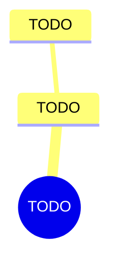

import { Aside, Badge, Card, CardGrid, Code, LinkCard, Steps, TabItem, Tabs } from '@astrojs/starlight/components';
import { Recall, Actions, Passage, Margin } from '@components';

{/* FIVE RULES THAT BREAK EVERY FIRST DRAFT. All five are in md-spec.md.

    1. MDX has no HTML comments. A comment is a brace, a slash, a star ... a
       star, a slash, a brace. AND A LITERAL STAR-SLASH INSIDE ONE CLOSES IT
       EARLY, which is how this exact line broke the sibling project's build.
    2. A bare < or { in prose is SYNTAX, not text. Put it in backticks.
    3. Blank lines around a component's inner content, or the Markdown inside
       it is not parsed as Markdown. Silent: it renders, just wrongly.
    4. The paste fence is FOUR backticks. This file contains three-backtick code
       blocks, and a three-backtick wrapper closes on the first one.
    5. Internal links are ROOT-ABSOLUTE. A relative ../ chain is a hard build
       error, never resolved. Paths are in src/generated/book-slugs.md. */}

{/* OUTLINE:START — generated by scripts/new-chapters.mjs from book.json. Do not edit by hand. */}
{/* OUTLINE:END */}

## Pre-context

{/* PRODUCED ON EVERY CHAPTER, clarified or not. P3 part A. Orientation is not
    summary: you need it before the ORIGINAL text as much as before a rebuild.
    This used to be listed as P3-only, which left it with no producer at all on
    a clarified: false chapter — chapter-spine.md section 1, "the three
    orphans". */}

TODO — what you need to have in mind before opening this chapter. Not a summary of it.

## Core message

{/* clarified: true  -> P3 produces this, before you read.
    clarified: false -> P4 produces it, AFTER your closed-book recall is marked.
    On familiar material, receiving the extraction before you read IS the
    summary that deletes the machinery. */}

:::note[Core message]
TODO — one sentence. If it takes two, the chapter has two messages and the brief should say so.
:::

## Key points

{/* Same producer rule as Core message above. */}

TODO — the load-bearing claims, not a précis. Load-bearing claims are unevenly
sized; a list where every point is the same length is a précis wearing a
different heading.

## The clarified chapter

{/* OMIT THIS WHOLE SECTION when the frontmatter says clarified: false.
    On familiar material the original is the better text, and a summary
    preserves the idea while deleting the machinery that made it actionable.
    The other three sections above STAY — only the rebuild is conditional. */}

TODO

<Aside type="note" title="What I cut, and why">
TODO — what the original had that this does not, and why it was safe to drop.
</Aside>

## Recall

<Recall minutes={10}>

TODO — **you** write this. Book shut, page collapsed, assistant off, BEFORE reading the
explanation layer below.

Then: the questions you could not answer.

</Recall>

## The explanation layer

{/* TEN sub-sections, generated below from chapter-spine.md section 3. The first
    is `### Where the author was standing`, added on his own instruction: a
    thought is derived from the circumstances of whoever had it, and knowing
    those is part of understanding what the claim actually means.

    It is here rather than in Pre-context because the explanation layer is read
    AFTER the closed-book recall — author context placed before the chapter
    would frame the reading and bias the retrieval.

    To push a spine change into stubs that already exist:
      node scripts/new-chapters.mjs <d> <c> <b> --spine
    It refuses any chapter that has been written in, and names it. */}

{/* SPINE:START — generated by scripts/new-chapters.mjs from book.json. Do not edit by hand. */}
{/* SPINE:END */}

## Dialogue

{/* THE ORDER IS THE POINT. Question first, position second, and the page must
    show them that way round — sycophancy is triggered by conveying a belief,
    so a position stated before the answer makes that answer suspect. */}

### What I asked

TODO

### What it said

TODO

### What I then argued

TODO

### Where we ended up

TODO

## Concept map

## Actions

<Actions />

## The 30-second version

TODO — what you would say about this chapter in a lift.

## Open questions

{/* LEFT EMPTY DELIBERATELY. The AI never writes here. Questions you could not
    answer are the highest-value note anyone keeps and the ones nobody records;
    this section exists to make you record them. */}

## Sources

| Claim | Source | Read on |
| --- | --- | --- |
| TODO | TODO | TODO |
