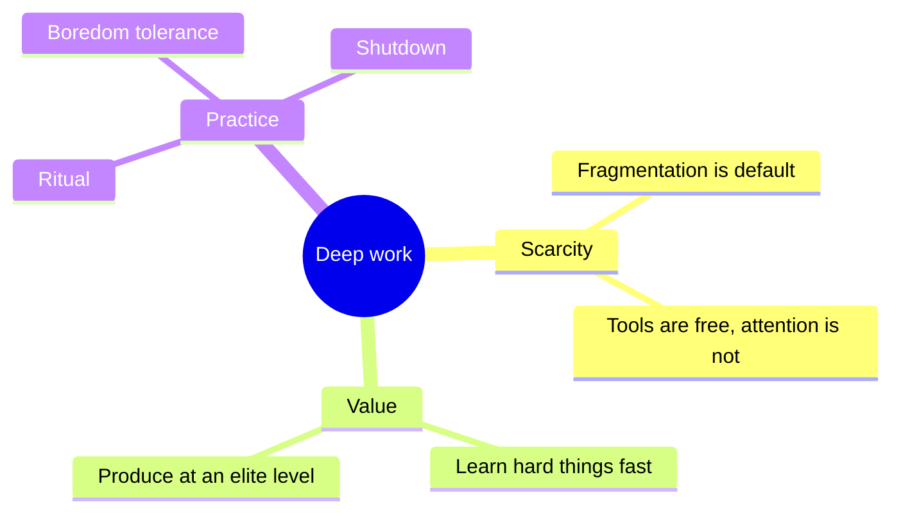
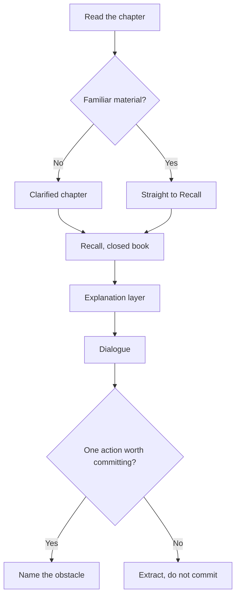
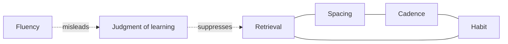
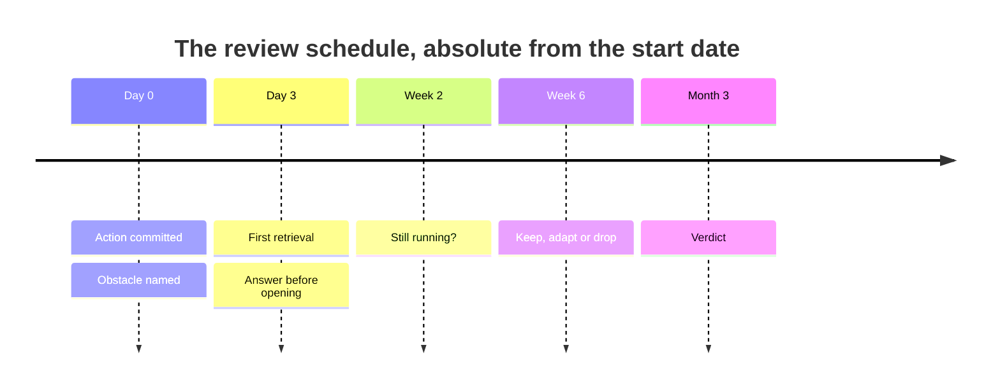
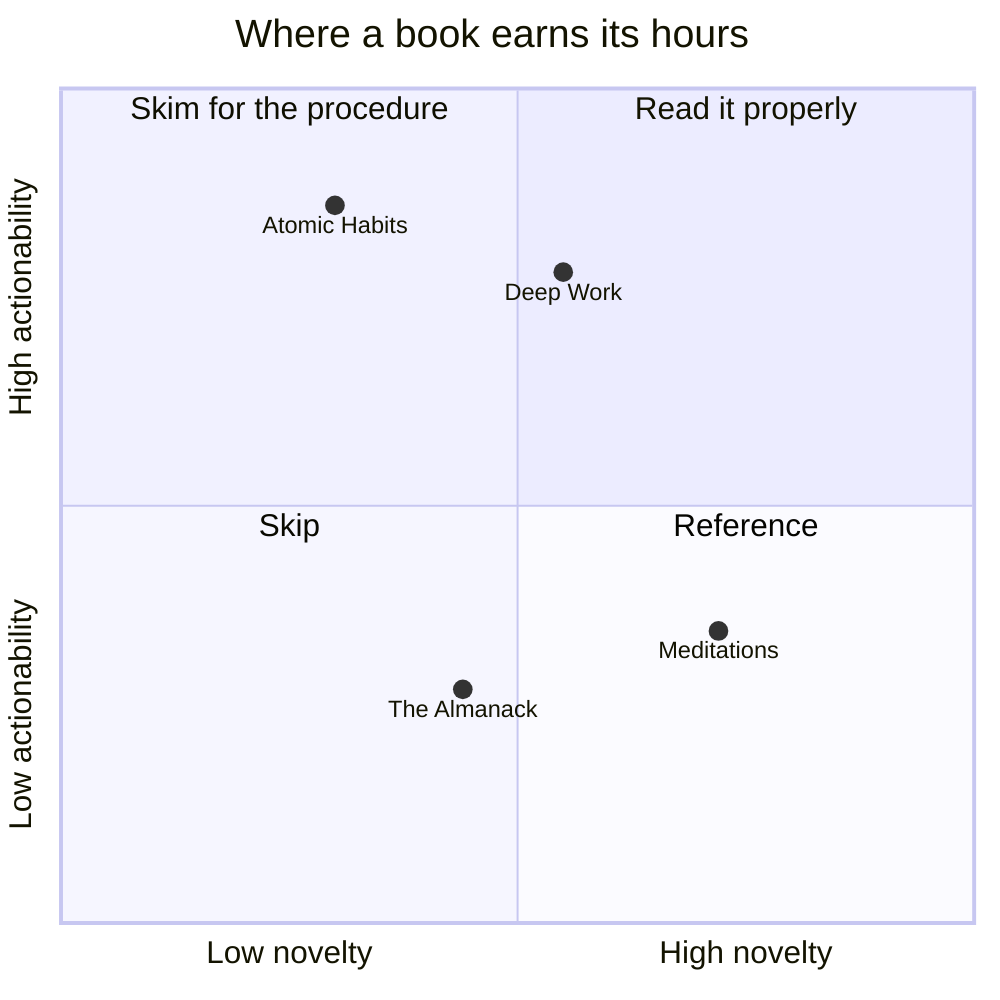
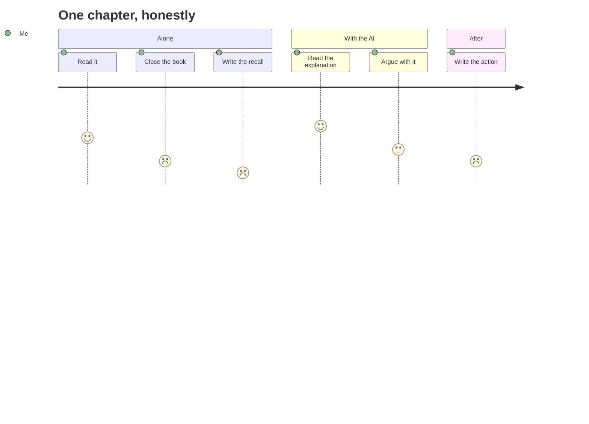

import { Aside, Badge, Card, CardGrid, Code, LinkCard, Steps, TabItem, Tabs } from '@astrojs/starlight/components';
import { Recall, Actions, Passage, Margin } from '@components';

**This page is built on every `npm run ci`, and that is the whole point of it.** It has one job:
**if an element renders wrongly, it renders wrongly here first** — once, on a page nobody is
reading — instead of inside a pasted chapter, where the defect is tangled up with content you were
trying to judge on its own terms.

:::danger[Why this page is published rather than drafted]
It was, for about ten minutes. Then it was probed: a deliberate `if (a < b)` outside backticks —
the single most common paste failure — was appended to it, and **`npm run ci` passed, 0 errors,
107 pages.** A draft page has no route, so Astro never compiles its body to JSX; the mermaid
pre-processor still touches it, which makes it *look* processed in the log.

**A draft page's MDX is never syntax-checked by anything.** That is fine for a stub, which contains
no prose. It would have made this page a control that controls nothing. So it is published, kept
out of the search index with `pagefind: false`, and linked from nowhere.
:::

It is the **ceiling made visible**. Everything on this page is available to a chapter. Nothing else
is. A paste using something absent here is a defect in the paste, not a feature request.

:::note[What it caught on its first pass, 2026-08-31]
Four defects, none of which any other check could see, all in the diagrams below:

- **`quadrantChart` rendered light panels with near-black text on the Night ground** — it writes
  colour as an inline `fill` attribute, so every `themeCSS` rule aimed at `.node` missed it.
- **Its data points were `fill="hsl(240, 100%, NaN%)"`** — invalid, and SVG paints an invalid fill
  **black**. A black dot on a black page in two themes, and an unexplained black dot in the other two.
- **`timeline` labels came out black on two of six section colours**, because its text nodes carry
  the literal class string `"null"` and no selector can reach them.
- **A diagram title measured 2.36:1** against Night — it was using the muted token, which is right
  for an axis tick and wrong for a title.

Every one of these is a **green build**. That is what this page is for.
:::

:::caution[This page deliberately breaks the chapter rules]
`chapter-spine.md` fixes twelve `##` headings and calls any other one a defect. That rule governs
**chapters**. This is a capability file — a different shape, like `_TEMPLATE-*` — and it uses
whatever headings make the elements findable. Do not copy its structure into a chapter.
:::

---

## The four custom components

Everything else composes from stock. These four exist because the reading protocol produces
something Starlight cannot express.

### `<Recall>`

`minutes` is optional and defaults to `10`. **Deliberately reads as a wall, not a note** — it is
the closed-book section, and the AI never writes inside it.

<Recall minutes={10}>

Book shut. Newport's argument, as far as I can reconstruct it: attention is the scarce input to
knowledge work, the tools that fragment it are economically rational for their makers and
irrational for me, and the fix is structural rather than motivational.

What I could not answer: whether he ever addresses work that is *genuinely* interrupt-driven, or
whether the whole book assumes a job I do not have.

</Recall>

Then the same element with no `minutes`, which is how most chapters will use it:

<Recall>

One sentence is a legitimate recall. A bad recall recorded honestly is worth more than a good one
written with the page open.

</Recall>

### `<Actions />`

**No children.** It reads `actions:` from the frontmatter, because actions are data and writing
them twice guarantees the two disagree. Both actions above render below — note the `id` printed
visibly on each card, which is what makes a rename something you can *see*.

<Actions />

### `<Passage>`

`at` is optional and carries the location. This is the only element on a chapter page whose words
came out of the **book**, and it looks different because its provenance is different.

<Passage at="p. 41">

The metric of busyness became a proxy for productivity precisely because knowledge work resisted
measurement.

</Passage>

<Passage>

A passage with no location. Still a quotation, still marked as one — but `at` is worth filling,
because Rule 8 is *open the original for the passages that matter* and a page number is what makes
that a two-second job.

</Passage>

### `<Margin>`

`label` is optional. Floats into the outer margin above 1200px and collapses inline below.
**Never load-bearing** — resize this window to check that the argument survives it moving.

<Margin label="Where this stops">

The scheduling advice assumes the interruptions are yours to refuse. Mine are not, most weeks.

</Margin>

<Margin>

An unlabelled margin note. Shorter, and it attaches to the paragraph beside it rather than
announcing a topic.

</Margin>

Ordinary body text continues here so the margin has something to sit beside. At a wide viewport the
two notes above are out in the gutter; below 1200px they are inline blocks in this column, in the
order they were written. Neither state may overlap this text, and no width between the two may clip
either one.

---

## Callouts

Both spellings produce the same element. The directive form is easier to type; the component form
takes a `title`.

:::note
A `:::note` directive. This is the default and needs no `type`.
:::

:::tip[The title is optional]
A `:::tip` with a custom title in square brackets.
:::

:::caution
A `:::caution`. For something that will cost you time if you skip it.
:::

:::danger
A `:::danger`. For something that will cost you *correctness* — a claim that failed replication, a
build error that ships silently.
:::

<Aside type="note" title="The component form">
Identical output. Use whichever reads better in the paste.
</Aside>

---

## Grouped boxes

<CardGrid>
	<Card title="A card">
		Grouped boxes. Good for key points, and for red flags beside green ones.
	</Card>
	<Card title="A second card" icon="open-book">
		Cards take an optional `icon` from Starlight's own set. No icon dependency is added.
	</Card>
</CardGrid>

<CardGrid stagger>
	<Card title="Staggered">
		`<CardGrid stagger>` offsets the second column. Use it for two things being compared, never
		for a sequence.
	</Card>
	<Card title="Against this">
		The stagger is decorative and disappears on narrow screens.
	</Card>
</CardGrid>

### Link cards

<LinkCard
	title="Deep Work"
	href="/self-command/attention-dopamine-and-digital-discipline/deep-work/"
	description="Root-absolute, as every internal link must be. A relative ../ chain is a hard build error."
/>

<LinkCard
	title="The shelf"
	href="/shelf/"
	description="Cross-links to books and chapters use this. Every path is in src/generated/book-slugs.md."
/>

---

## Tabs

For **one thing seen three ways** — never for sequential steps. `syncKey` makes every tab group on
the page switch together.

<Tabs syncKey="view">
	<TabItem label="The book's version">
		Depth of work is a trainable capacity, and the fragmentation is the whole problem.
	</TabItem>
	<TabItem label="The critics' version">
		The prescription assumes autonomy over your calendar, which most of the workforce does not
		have. The advice is real; its audience is narrower than the book admits.
	</TabItem>
	<TabItem label="What I'll hold">
		The mechanism, not the schedule. Protect the two hours I *can* control and stop treating the
		other six as a failure.
	</TabItem>
</Tabs>

---

## Steps

Sequential procedures only. **Blank lines between items are required**, or the Markdown inside them
is not parsed.

<Steps>

1. Read the chapter. Book only, no AI, no notes.

2. Close it and write `## Recall` from memory. Ten minutes, badly is fine.

3. **Only then** open the explanation layer.

4. Write the action yourself, and name the obstacle.

</Steps>

---

## Badges

<Badge text="Stub" variant="default" /> <Badge text="Reading" variant="note" />
<Badge text="Complete" variant="success" /> <Badge text="Skipped" variant="caution" />
<Badge text="Dropped" variant="danger" /> <Badge text="Core" variant="tip" size="small" />
<Badge text="Large" variant="default" size="large" />

---

## Code

A fenced block, which is what a chapter will almost always want:

```yaml title="chapter frontmatter"
actions:
  - id: dw-02-timeblock
    if: "it is 21:30 on a workday"
    then: "I write tomorrow's three blocks in the notebook"
    obstacle: "I tell myself I will remember it in the morning"
    tier: now
    committed: true
```

```js title="the escaping rule" {2}
// Bare < and { are SYNTAX in MDX, not text.
if (a < b) { console.log('this line is only safe inside a fence'); }
```

And `<Code />`, for when the source is a variable rather than literal text:

<Code code={`const measure = cpl * advance * size + gutter;`} lang="js" title="reading.css, as JS" />

**Every fence carries a language tag.** Untagged fences lose highlighting silently.

---

## Diagrams — the six declared types

Mermaid, in a fenced block. **Never hard-code a colour**: these re-theme across all four reading
themes automatically, and a literal hex will be wrong in three of them. Toggle the theme with the
`Aa` control while this page is open — every diagram below must follow it.

### `mindmap` — a chapter concept map



### `flowchart TD` — a process or causal chain



### `graph LR` — non-hierarchical relationships



### `timeline` — an arc



### `quadrantChart` — a two-axis comparison



### `journey` — a sequence with a felt quality



**A diagram that restates the paragraph above it has not earned its place.** Show relationships,
not a list of nouns.

---

## What Markdown gives you free

Ordinary **bold**, *italic*, `inline code`, ~~strikethrough~~, and a [root-absolute
link](/shelf/). True quotation marks and dashes come from the typography layer — "like this" — and
ligatures are on in the serif.

> A blockquote. Used for a line of the book that is being *discussed* rather than quoted for its own
> sake — when it is the latter, `<Passage>` is the element, because provenance is the difference.

| Column | What it holds | Rule |
|---|---|---|
| GFM tables | Anything tabular | Wide ones scroll inside their own container |
| Footnotes | An aside that would break the sentence | Renders at the foot with a backlink[^1] |
| Task lists | A checklist that is *not* an action | Actions are frontmatter, never a checkbox |

- [x] A completed task-list item
- [ ] An incomplete one
- Nested lists:
  - work to any depth
  - and keep their spacing

1. Ordered lists
2. Renumber themselves
3. Even when you get the source wrong

[^1]: The footnote. Both directions of the link are generated, and both are anchors, so both are
      contracts — renaming a heading breaks inbound links the same way.

### Headings are anchors, and anchors are contracts

Every heading on this page has an anchor you can link to. That is why paraphrasing one of the twelve
chapter headings is a defect rather than a style choice: it breaks every inbound link, the review
loop, and search, and it does all three silently.

#### An `h4`

In a **chapter**, an `####` means the chapter should have been split, which is a `book.json`
amendment rather than a heading choice. Here it just proves the level renders.

---

## What is not available — the triage

**All the judgment is in this table. The inventory below it is neutral and long, and you should not
need it.** Three verdicts, and the difference between them is the whole point:

| Verdict | Means |
|---|---|
| **BREAKS** | It fails the build. Loud, immediate, and there is a substitute |
| **REFUSED** | It would work, and it is not here **because it would undermine the mechanism** — not because it costs too much |
| **DEFERRED** | Merely nicer. Logged, opened in a quarterly pass, and untouched until then |

### BREAKS — it fails the build, and here is the substitute

| Wanted | Reality | Instead |
|---|---|---|
| Maths, `$$…$$` | **Not enabled.** The braces parse as MDX and hard-fail | A fenced block, or an image |
| An HTML comment `<!-- -->` | A parse error in MDX | `{/* … */}`, and **never** containing a literal `*/` |
| A fifth custom component | `Expected component X to be defined: you likely forgot to import, pass, or provide it.` | Say it in one sentence. A fifth requires an explicit written request in the session that needs it |
| A second diagram tool | Mermaid is the ceiling | One of the six types above |
| `a <b` in prose | *Unexpected character after a less-than sign, expected a valid JSX tag* — **and `a < b` with spaces is fine**, which is why this one is confusing | Backticks. Correct either way |
| `{threshold}` in prose | `ReferenceError: threshold is not defined` — a **runtime** error, so a draft page never reaches it | Backticks |
| A relative link `../foo` | `relative link` — a hard error, never resolved | Root-absolute. Paths are in `src/generated/book-slugs.md` |
| A link to a `draft: true` page | It has no URL in `build` | Plain text until it is published |
| `#anchor` that does not exist on the target | `invalid hash` | Paraphrasing a `##` heading breaks every inbound link at once. Do not |
| Emoji in a heading | Breaks anchors, pollutes the search index | Put it in the body, or nowhere |
| An image in `public/` | Builds, and silently costs ~88% of the bytes, the hashed filename, the dimensions and the year-long cache | `./name.png`, **beside the chapter** |

### REFUSED — it would work, and that is the problem

**These are the ones worth reading.** Every one is technically easy, several are the obvious next
feature, and each would quietly break something this system exists to protect.

| Wanted | Why it is refused |
|---|---|
| **"Chat with my library"** — ask a question across every chapter | **Letting AI do the retrieval is the crutch effect.** Retrieval scored 61% against 40% for rereading, and the entire reconciliation exists to keep the retrieval on his side of the line. A search box that answers is a search box that reads for you |
| **Auto-generated "key takeaways"** on each chapter | It is `## Recall` with the work removed. The page would then contain a better-written version of the one section he is supposed to produce closed-book, immediately above it |
| **A reading streak** | The evidence wants a person and a physical record, and this site can supply neither. A streak **simulates** accountability, which is worse than admitting there is none — and a missed day would read as a broken streak, which is exactly how a schedule gets abandoned in week three |
| **A "books finished" counter, or a completion percentage** | *"The ledger is the metric. The count is vanity."* A percentage also puts a completion instinct onto `reference` and `lifelong` books, where finishing is not the goal |
| **Anything that asks him to picture the outcome** — a "visualise your progress" panel, a projected finish date | **The strongest negative finding in the evidence base.** Positive fantasy predicts LOWER attainment. Nothing on this site may contradict it, and this is where a well-meaning progress widget would land |
| **AI-written actions or obstacles** | `P0`'s one rule. An excellent commitment the model wrote produces the feeling of being finished and no change in behaviour |
| **Within-chapter pagination** | Breaks search, anchors, diagrams and code blocks. The page turn *between* chapters gives the same feeling at the moment that actually means something |
| **Reading analytics beyond the local session timer** | The timer is local, never leaves the browser, shows no target and has no streak. That is the ceiling, and it is a ceiling rather than a starting point |
| **A rate table converting words to reading minutes** | **He rejected the premise.** *"if a chapter is 10 hour or unlimited long, you do it."* A per-section budget would import a constraint he explicitly declined |
| **Deciding what transfers to his life** | *"you don't remove, alter the things that author wanted to say for original intent, you can give extra instead."* The section may describe where conditions differ; the conclusion is his |

### DEFERRED — merely nicer, and not now

Logged rather than built, because **the design system is frozen** and the drafts name building the
site as *"the most sophisticated procrastination available to me."* Opened in a quarterly pass.

| Wanted | Note |
|---|---|
| A seventh mermaid type | Six cover every shape used so far. Adding one is a ceiling change, not a fix |
| Per-book accent colour | Would break the tier legend, which is an identity across four themes |
| A dark-mode-only illustration variant | Nothing needs it yet |
| Footnote-style margin notes with automatic numbering | `<Margin>` already floats above 1200px and collapses inline below |
| Export a chapter to PDF | The browser does it, and `custom.css` already carries a print block |

---

## The full inventory — neutral, and you should not need it

Everything on this page, in one list, with no judgment attached. If something is not here, it does
not exist for a chapter.

**Custom (four, and there is no fifth):** `<Recall>` · `<Actions />` · `<Passage>` · `<Margin>`

**Stock Starlight (seven):** `<Aside>` — four types · `<Tabs>` / `<TabItem>` · `<Steps>` ·
`<Card>` / `<CardGrid>` · `<LinkCard>` · `<Badge>` · `<Code>`

**Mermaid (six):** `mindmap` · `flowchart TD` · `graph LR` · `timeline` · `quadrantChart` ·
`journey`

**Markdown, free:** headings and anchors · GFM tables · footnotes · task lists · ordered,
unordered and nested lists · blockquotes · inline bold, italic, strikethrough and code · fenced code
with a language tag · horizontal rules · links

**From the build, free:** full-text search · four reading themes with a toggle · breadcrumbs ·
prev/next scoped to the book · build-time link validation · "Last updated" from `read:` ·
a `.md` sibling for every page · `llms-full.txt`

**Composition rules** are in `/method/` and `context/md-spec.md` §5b. The one that catches everyone:
**blank lines are required around a component's inner content**, or the Markdown inside is not
parsed as Markdown — and it renders, just wrongly.

---

## Open questions

Left empty on purpose, even here. On a chapter page this is the prohibition zone: **the AI never
writes in it**, because the questions you could not answer are the highest-value note anyone keeps
and the ones nobody records.

## Sources

- `context/md-spec.md` §3 and §5 — the authoring contract this page is the rendering of. **That
  file is the source; this page is the proof.** If they disagree, `md-spec` is right and this page
  has rotted.
- `context/chapter-spine.md` §1 — the twelve headings, and why this page is exempt from them.
- `context/source-rules.md` — what a citation must **be**, which is a different question from
  whether one exists.
