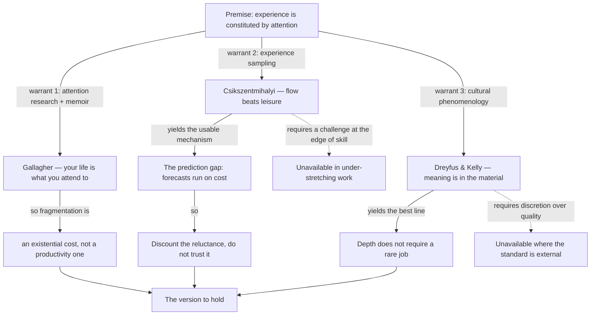

import { Aside, Badge, Card, CardGrid, Code, LinkCard, Steps, TabItem, Tabs } from '@astrojs/starlight/components';
import { Recall, Actions, Passage, Margin } from '@components';

{/* OUTLINE:START — generated by scripts/new-chapters.mjs from book.json. Do not edit by hand. */}
{/* THE BRIEF DECIDED THIS. Generation fills prose into it, and never invents it.

   book        Deep Work — Cal Newport
   chapter     3 · Deep work is meaningful
   part        The idea — Say what deep work is, why it is valuable and why it is becoming rare.
   argues      Depth is worth defending on craft and attention grounds even where the economic argument does not hold.
   weight      supporting in the book's argument
   verdict     skim
   estimate    25 min
   clarified   true

   clarified true, so the clarified-chapter section is present and gets written.

   gap         execution — reading will not fix a doing problem. Weight the actions, trim the explanation.

   The reader writes the recall section CLOSED BOOK, before reading the
   explanation layer, and fills the open-questions section by hand.
   Never write in either. */}
{/* OUTLINE:END */}

## Pre-context

This is the third leg of the argument and the one that does not need to be there. Chapters 1 and 2
made the scarcity case — depth is valuable, depth is rare — and that case is complete without any
appeal to meaning. This chapter exists to answer a reader who accepts the economics and still asks
why they should care.

Three things it assumes you know.

**Gallagher's attention thesis.** Winifred Gallagher's *Rapt* (2009) argues that the shape of your
experienced life is determined by what you attend to, not by what happens to you. Newport borrows
this wholesale as his neurological leg and does not re-argue it.

**Csikszentmihalyi's flow.** The finding that people report their best experiences during effortful,
skilled, absorbing activity rather than during leisure — and specifically that this is *counter* to
what people predict about themselves. Newport uses this as his psychological leg.

**Dreyfus and Kelly on craft.** *All Things Shining* (2011) and the idea of *sacredness in craft* —
that a skilled practitioner encounters meaning in the material itself rather than importing it. This
is the philosophical leg, and it is the one most readers find either the best or the worst part of
the chapter.

Three legs, three borrowed sources, and the chapter's own contribution is the claim that they point
the same way.

## Core message

:::note[Core message]
Depth is not only economically valuable but constitutive of a life that feels worth living, because
what you attend to over long stretches is what your experienced life is made of.
:::

## Key points

1. **The neurological argument.** Your world is the sum of what you attend to. Fragmented attention
   therefore produces a fragmented experienced life, independently of what that life contains.
2. **The psychological argument.** Flow states are where people report their best experiences, and
   flow requires exactly the sustained, effortful, skill-stretching conditions that define deep
   work. Leisure, which people predict will be better, mostly is not.
3. **The philosophical argument.** Craft encounters meaning in the material rather than importing it
   from outside, which means depth is available in ordinary work rather than only in extraordinary
   work.
4. **The synthesis, which is the actual claim.** Three independent traditions converge, and the
   convergence is the argument — no single leg carries it.

Point 4 is the one to hold, because it is also where the chapter is most vulnerable: if the legs are
not really independent, the convergence proves much less than it appears to.

## The clarified chapter

*Rebuilt because `clarified: true` — this is a `skim` chapter on familiar material where the
original's structure is looser than its argument.*

The chapter opens with Ric Furrer, a blacksmith forging a Viking sword, and stays with him longer
than a reader expects. The point of the length is that Furrer is not doing anything culturally
prestigious. He is heating and folding metal. The meaning is not in the significance of the object;
it is in the quality of the attention the work demands. That is the whole thesis, stated as a scene
before it is stated as an argument.

Then three arguments, in ascending order of ambition.

**Neurological.** Gallagher's claim, following from attention research and from her own experience
of a cancer diagnosis: who you are and what you feel is the sum of what you attend to. She reports
choosing, deliberately, to fill her attention with things other than the illness, and reports that
this worked. Newport's extension is direct: if attention determines experienced life, then habitual
fragmentation is not a productivity problem but an existential one. You are not losing output. You
are losing the material your life is made of.

**Psychological.** Csikszentmihalyi's experience-sampling work, over decades, found that people
report their highest-quality experiences during absorbed, effortful activity that stretches a skill
— and report much lower quality during the leisure they had been looking forward to. The gap
between predicted and reported enjoyment is the finding, not the flow state itself. Newport's
extension: if the conditions for flow and the conditions for deep work are the same conditions, then
deep work is not a sacrifice made for career reasons that happens also to feel good. The feeling and
the productivity have a common cause.

**Philosophical.** Dreyfus and Kelly argue that a world that has lost shared external sources of
meaning has not lost meaning as such — it has relocated it into craft. The craftsman does not decide
that the wood is meaningful. They encounter meaning already present in the material, available only
to someone with the skill to see it. Newport's extension is the most useful sentence in the chapter,
and it is easy to miss: **you do not need a rare job to do this.** The meaning is in the depth of
engagement, not in the prestige of the task, which is why the chapter's exemplar is a blacksmith and
not a novelist.

The three then close on each other. Attention determines experience; the best experiences come from
absorbed effort; absorbed effort in a craft encounters meaning in the material. So a working life
organised around depth is not an instrumental trade. It is the thing itself.

:::caution[What I cut, and why]
Cut: the extended retelling of Gallagher's cancer diagnosis beyond the two sentences that carry the
argument — the original spends roughly three pages on the narrative, and the claim it supports is
fully stated in the first paragraph of it. Cut: the second and third Furrer passages, which are the
same scene at the same intensity and are there for rhythm rather than for content. Cut: the
digression on Nietzsche and the death of God, which sets up Dreyfus and Kelly and is a summary of a
summary.

**Kept, deliberately, against the instinct to cut it:** all of Furrer's first scene, at full length.
It looks like colour and it is not — the specificity of the forging, the folding, the heat, is what
makes "meaning is in the material" a claim rather than a slogan, and every short summary of this
chapter I have read loses the argument at exactly the point where it loses the blacksmith.
:::

## Recall

<Recall minutes={10}>

Written closed-book, 2026-08-24, before the explanation layer.

The argument is that depth is not just useful, it is where meaning lives. Three routes to the same
place.

One: your life is what you pay attention to. There's a woman — Gallagher — who had cancer and
decided to fill her attention deliberately, and the general claim is that attention constructs
experience. So a scattered attention is a scattered life, whatever is actually in it.

Two: flow. People are happiest doing hard absorbing things, not resting, and they consistently
predict the opposite. Deep work and flow have the same preconditions.

Three: the craft one. There's a blacksmith making a sword and the point is that meaning isn't in how
impressive the job is, it's in the quality of attention the work demands. Dreyfus and Kelly. Meaning
is found in the material rather than added to it.

The synthesis is that all three arrive at the same recommendation from unrelated directions.

**Questions I could not answer:**

- Is the Gallagher claim actually a neurological one or is it a philosophical one wearing
  neuroscience? I could not tell from the chapter and I suspect that matters.
- If flow needs a skill match, what does this chapter say to someone whose work is below their skill
  level? It felt like it did not address that at all.
- Why is this chapter in the book? The economic argument was already complete. Is it persuasion or
  is it load-bearing?

</Recall>

## The explanation layer

{/* SPINE:START — generated by scripts/new-chapters.mjs from book.json. Do not edit by hand. */}

### Where the author was standing

The relevant fact is that Newport was writing the third chapter of a business book and had a problem
of genre. The economic argument was finished at the end of Chapter 2, and a book that stopped there
would have been a long article. More importantly, a purely economic case for concentration is one
that a reader can accept and decline — *yes, it would pay, and I would rather not.*

So this chapter is doing a specific job: closing the exit. That predicts where the argument bends.
It will reach for whatever supports the conclusion, from wherever, and it will not be very careful
about whether the three sources are actually compatible with each other. Gallagher's attention
thesis, Csikszentmihalyi's experience sampling and Dreyfus and Kelly's phenomenology of craft come
from three traditions that do not otherwise talk, and they are not reconciled here — they are
stacked.

It is also worth naming that Newport is, by his own account, a person who genuinely experiences this.
The chapter is not cynical. But a sincere argument assembled to close an exit is still an argument
assembled to close an exit, and this one shows the seams.

### What the author is actually saying

> You can accept that depth pays and still not do it, because paying is not a reason to organise a
> life. So here is the other case. Attention is not a resource you spend on your life — it is the
> material your life is made of, so a habitually fragmented attention produces a fragmented life
> regardless of what that life contains. The best moments people report are absorbed, effortful and
> skilled, not restful, and people are systematically wrong about this in advance. And meaning in
> work is found in the depth of engagement rather than in the prestige of the task, which means it
> is available in whatever you already do. Depth is therefore not a price you pay for a career. It
> is closer to being the point.

### Where readers get confused

**"He's saying my job has to be meaningful."** The opposite, and it is the chapter's best move. The
Furrer example is chosen because blacksmithing is not prestigious. The claim is that depth of
engagement generates the meaning, so the nature of the job is much less relevant than readers
expect.

**"Flow means enjoying your work."** Flow is a specific state with specific preconditions — a skill
at the edge of its range, clear goals, immediate feedback. Pleasant work is not flow. Work you are
comfortably good at is specifically not flow, which is why the chapter's argument says nothing
consoling to someone under-stretched by their job.

**"This is the soft chapter, I can skip it."** Defensible — the brief marks it `skim` for exactly
this reason. But the one sentence worth carrying, that depth does not require a rare job, lives only
here.

**"Gallagher proved that attention determines wellbeing."** She argued it, from a mixture of
attention research and personal testimony. The chapter's framing borrows the authority of the first
for the reach of the second.

### The teaching pass

The mechanism worth teaching is the one the chapter half-states and never isolates: **the prediction
gap.**

The finding from experience sampling is not that flow is pleasant. It is that people are *wrong in
advance* about what will be pleasant, and wrong in a consistent direction. Asked to predict, people
choose rest, ease and passive leisure. Sampled in the moment, people report their best experiences
during effortful absorbed activity. The two do not match, and the mismatch is stable.

Why would that be? Because prediction and experience are made by different processes. Prediction
runs on the *cost* of the activity, which is available in advance: effort, difficulty, the
possibility of failing. Experience runs on what the activity does to attention while it is
happening, which is not available in advance at all. So the forecast is systematically biased by
exactly the amount of effort involved — the harder the thing, the worse you predict it, and the more
likely it is to have been good.

This is worth isolating because it changes what you do with the chapter. If the claim were "flow
feels good", the response would be to seek flow, which is not actionable. If the claim is "your
forecast of how an effortful session will feel is biased downwards, reliably", then the response is
mechanical: **discount the forecast rather than trusting it.** The reluctance you feel at 09:00
about a three-hour block is data about the cost, not about the experience, and it is the input the
chapter's own evidence says is unreliable.

That is a usable version of a chapter that is otherwise almost entirely inspirational.

<Passage at="Ch. 3, on the craftsman">
The task of a craftsman is not to generate meaning, but rather to cultivate in himself the skill of
discerning the meanings that are already there.
</Passage>

### What real readers say

Searched 2026-09-04: reviews naming Chapter 3, the Furrer sections in the HN threads.

This is the most polarising chapter in the book and the split is unusually clean. Readers who liked
it describe the Furrer passage as the part of the book they remember years later. Readers who
disliked it use the word *padding*, and several say explicitly that they skipped from Chapter 2 to
Part 2 and recommend others do the same.

A third and smaller group is the one worth attending to: readers who report that the chapter changed
what they thought the book was *for* — that they came for productivity and left with something
closer to a position on work. Whether that is a virtue depends on what you wanted.

**Thin, and it should be said.** There is very little substantive engagement with the chapter's
actual arguments in public reviews. Almost all the commentary is about whether the chapter was
enjoyable. I could not find anyone arguing with Gallagher's thesis as Newport uses it, which is a
gap in the reception rather than in the chapter.

### What critics say

**The three legs are not independent, and the convergence argument needs them to be.** This is the
strongest objection. Gallagher, Csikszentmihalyi and Dreyfus & Kelly all begin from a broadly
phenomenological premise — that the quality of experience is constituted by the structure of
attention. If they share that premise, then three traditions agreeing is one premise restated three
times, and the "independent convergence" that gives the chapter its rhetorical force evaporates. The
chapter presents the agreement as evidence and never checks whether the sources could have
disagreed.

**Selection on the dependent variable.** Furrer chose blacksmithing and stayed. The chapter does not
contain anyone who went deep into a craft and found it empty, or who could not reach the skill level
where meaning becomes available. Given the thesis that meaning is discerned by the skilled, the
people for whom this fails are precisely the ones who would never be interviewed.

**It cannot distinguish itself from an adaptation argument.** A critic can accept every word and
read it as: people who do absorbing hard work report it as meaningful, which is what you would
predict whether the meaning is real or whether humans reliably narrate effort as significant after
the fact. The chapter has no way to tell those apart and does not try.

**The craft framing is class-inflected in a way it does not notice.** Choosing a blacksmith as the
exemplar of unprestigious work is a choice made by someone for whom blacksmithing is romantic. The
argument would be tested by an exemplar the reader would not want to be.

### What's been tested since

**Flow and experience sampling.** The core finding — higher reported experience quality during
absorbed effortful activity than during passive leisure — has replicated broadly and is one of the
more durable results in the area. **Verdict: holds.**

**The prediction gap specifically.** The affective-forecasting literature independently supports the
claim that people mispredict future experience in systematic directions, though the classic work
there is about the *duration* of emotional reactions rather than about effort specifically. The
effort-discounting version the chapter needs is supported by adjacent work rather than by direct
replication. **Verdict: well-supported by neighbours, not directly tested in this form.**

**Attention and wellbeing.** Killingsworth & Gilbert's 2010 experience-sampling study of 2,250
people found that mind-wandering predicted lower subsequent happiness, and did so across essentially
every activity — which is the strongest direct support Gallagher's thesis has, and Newport does not
cite it. **Verdict: the chapter's weakest-sourced leg turns out to have better evidence than the
chapter uses.**

**Meaning in craft.** Not an empirical claim and not testable as stated. The chapter is clear that
this leg is philosophical. **Verdict: not applicable, and honestly labelled.**

### How practitioners actually use it

This chapter is barely operationalised, and that is the honest report. Almost nobody builds a
practice on it. What it is used for, at scale, is *justification* — it is the chapter people cite
when explaining a change they had already decided to make, to a spouse or a manager or themselves.

Where it does turn into practice, it takes one of two shapes.

**The forecast-discounting rule.** Individuals who have extracted the prediction gap describe a rule
of the form "start the block before deciding whether to start the block", usually applied to a
single recurring session per week. Small scale by nature — one person, one session.

**The craft log.** A few practitioners keep a note of whether work was worth doing well, separately
from whether it shipped. Reported honestly as low-value by most who try it and quietly abandoned
within a month or two. Worth recording precisely because it is the obvious thing to build from this
chapter and it mostly does not survive contact.

**No organisational use at all.** I found no team-level or company-level implementation of anything
in this chapter, which is unsurprising: it is an argument addressed to a person about their own life.

### Where it doesn't transfer

**Where the work is below the skill level, flow is unavailable by definition.** Flow requires a
challenge at the edge of ability. A person in work that is well within their range cannot reach the
state the chapter recommends by concentrating harder, because the missing ingredient is difficulty
rather than attention. The chapter never addresses this, and it is the most common actual situation.

**The craft argument assumes discretion over how well a thing is done.** Dreyfus and Kelly's
craftsman decides the standard. Where the standard is set externally and the reward is for
completion rather than quality — most contract and volume work, a great deal of outsourced
engineering — the meaning the chapter locates in the material is not accessible by the route it
describes, because doing it better is not permitted rather than not chosen.

**The individualist framing of meaning is a specific tradition, not a neutral one.** The chapter
locates meaning in the individual's engagement with their material. Traditions in which meaning is
constituted relationally or communally — which includes most of the Newar and broader Nepali
frames within which work sits inside obligation to family and community — are not addressed by this
argument. They are not incompatible with it; they simply answer the question at a different level,
and a person holding both is holding two accounts of the same thing rather than one.

**Where work is instrumental by necessity, the chapter's premise does not bind.** Where a job exists
to produce income for people who depend on it and its own qualities are not the point, the question
"is this meaningful" is not the operative question, and the chapter has nothing to say about the
question that is.

### The version to hold

:::tip[The version to hold]
Two things survive. First, the strongest and least-quoted line: **depth does not require a rare
job** — meaning is in the engagement rather than the prestige, which is why the exemplar is a
blacksmith. Second, the mechanism worth using: your forecast of how an effortful session will feel
is biased downwards, reliably, because prediction runs on cost and experience runs on attention — so
discount the reluctance rather than trusting it.

The scar: the chapter's rhetorical force comes from three traditions agreeing, and they share a
premise, so the convergence is much weaker evidence than it reads as. And flow needs a challenge at
the edge of your ability, which means for work below your skill level this chapter's advice does not
fail — it does not apply.
:::

{/* SPINE:END */}

## Dialogue

### What I asked

If the three arguments share a phenomenological premise, is there anything left of the convergence
claim, or is the chapter just one argument told three times?

### What it said

Something is left, but less than the chapter claims. The three do share the premise that experience
is constituted by attention. What they do not share is the *warrant*: Gallagher argues from attention
research, Csikszentmihalyi from large-scale sampling data, Dreyfus and Kelly from a reading of
cultural history. So it is one thesis with three independent lines of support, which is a real thing
— but it is not three independent theses converging, which is what the chapter's rhetoric implies.
The difference matters because independent conclusions are much stronger evidence than shared
conclusions with different reasons.

### What I then argued

I argued that this is a distinction the chapter needs and does not make, and that making it deflates
the chapter substantially — because once it is one thesis, the whole chapter rests on whether
attention really does constitute experience, and that is a philosophical position I am being asked
to accept on the strength of a cancer memoir and a sampling study.

### Where we ended up

Moved, partly, and not where I expected. It pointed out that Killingsworth and Gilbert's 2010 study
is much better direct evidence for exactly that premise than anything the chapter uses, and that my
objection is therefore an objection to Newport's sourcing rather than to the claim. I accept that.
I still think a chapter whose central premise is better supported by a study it does not cite is a
chapter that was assembled rather than argued, and it thinks that is a criticism of the writing and
not of the position. That is where we stopped.

## Concept map

## Actions

<Actions />

## The 30-second version

The economic case for depth was finished a chapter ago; this one closes the exit. Attention is the
material a life is made of, absorbed effort beats leisure and people reliably predict otherwise, and
meaning is discerned in the material rather than supplied by a prestigious job. The line worth
keeping is that depth does not require a rare job. The mechanism worth keeping is that your dread of
a hard block is a forecast of its cost, not of its experience.

↔ [Ch 5 · Embrace boredom](/self-command/attention-dopamine-and-digital-discipline/deep-work/embrace-boredom/)
is where the prediction gap becomes a training problem rather than a motivational one.
↔ [Ch 1 · Deep work is valuable](/self-command/attention-dopamine-and-digital-discipline/deep-work/deep-work-is-valuable/)
is the argument this chapter is compensating for.

## Open questions

- Is the prediction gap really about effort, or is it about *novelty* — do I mispredict the hard
  block or do I mispredict any block I have not started?
- If flow needs a challenge at the edge of skill, and most of my week is not at the edge of my
  skill, then is the chapter telling me to change the work rather than the attention? It does not
  say so and I think it might follow.
- I marked this `skim` in the brief and then read it properly. Was that a mistake in the brief or a
  mistake in the reading?

## Sources

| Claim | Source | Read on | Tier |
| --- | --- | --- | --- |
| The three arguments; Ric Furrer; the craftsman's task | *Deep Work*, Cal Newport, Grand Central 2016, Ch. 3 | 2026-08-24 | A — the book itself |
| Attention constructs experienced life | Gallagher, *Rapt: Attention and the Focused Life*, 2009 — cited by Newport | 2026-08-24 | B — the book's own cited source, not independently read |
| Flow; experience sampling; best experiences during effortful absorbed activity | Csikszentmihalyi, *Flow*, 1990 — cited by Newport | 2026-08-24 | B — cited source, familiar but not re-read for this |
| Meaning is discerned in the material, not generated | Dreyfus & Kelly, *All Things Shining*, 2011 — cited by Newport | 2026-08-24 | B — cited source, not read |
| Mind-wandering predicts lower subsequent happiness, n≈2,250, across activities | Killingsworth & Gilbert (2010), *Science* 330(6006) — [doi:10.1126/science.1192439](https://doi.org/10.1126/science.1192439) | 2026-09-04 | A — primary, large sample. NOT cited by Newport |
| The chapter is polarising; "padding"; the Furrer passage is what readers remember | Goodreads and Hacker News reviews naming Ch. 3 | 2026-09-04 | C — public opinion, about reception only |
| The craft log is usually abandoned within a month or two | Scattered practitioner reports; genuinely thin and stated as such | 2026-09-04 | C — practitioner report, uncontrolled |
