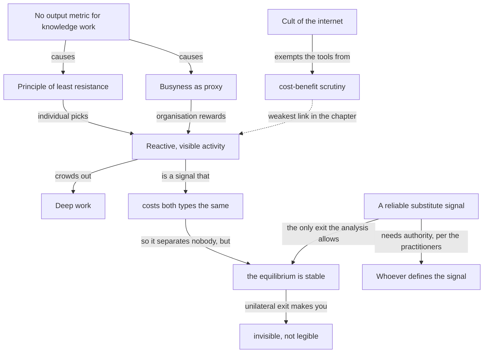

import { Aside, Badge, Card, CardGrid, Code, LinkCard, Steps, TabItem, Tabs } from '@astrojs/starlight/components';
import { Recall, Actions, Passage, Margin } from '@components';

{/* OUTLINE:START — generated by scripts/new-chapters.mjs from book.json. Do not edit by hand. */}
{/* THE BRIEF DECIDED THIS. Generation fills prose into it, and never invents it.

   book        Deep Work — Cal Newport
   chapter     2 · Deep work is rare
   part        The idea — Say what deep work is, why it is valuable and why it is becoming rare.
   argues      Organisations destroy depth not out of malice but because visible busyness is the only productivity signal knowledge work has left.
   weight      load-bearing in the book's argument
   verdict     deep-dive
   estimate    30 min
   clarified   false

   clarified false, so the clarified-chapter section has been REMOVED from this
   file entirely. READ I is the original text. On familiar material a summary
   preserves the idea and deletes the machinery that made it actionable.

   gap         execution — reading will not fix a doing problem. Weight the actions, trim the explanation.

   The reader writes the recall section CLOSED BOOK, before reading the
   explanation layer, and fills the open-questions section by hand.
   Never write in either. */}
{/* OUTLINE:END */}

## Pre-context

This chapter is the second half of a pair. Chapter 1 argued that depth is valuable; this one argues
that it is rare, and the two together are the scarcity claim the whole book rests on. If you read
this one alone it will read as complaint. It is not complaint — it is the supply side.

Three things must already be in your head.

**The metric-black-box problem.** Peter Drucker coined "knowledge worker" in 1959 precisely because
he could not measure the output the way industrial work was measured. That unresolved measurement
problem is the engine of this entire chapter, and Newport does not restate it — he assumes it.

**The principle of least resistance.** Newport's own term, introduced here. In the absence of clear
feedback on the bottom-line impact of a behaviour, people default to the behaviour that is easiest
in the moment. It is not a claim about laziness; it is a claim about what happens when a feedback
loop is missing.

**Busyness as a proxy for productivity.** Also his term, and the one that does the work. It is a
signalling argument, not a psychological one, and reading it as "people like looking busy" loses it.

What this chapter is *not* is a chapter about willpower. Nothing in it is about the individual. That
is Chapter 4.

## Core message

:::note[Core message]
Organisations destroy concentration not because anyone decides to, but because knowledge work has no
agreed output metric, and in the absence of one visible activity becomes the metric by default.
:::

## Key points

Three claims, in descending order of how much weight they carry.

1. **The metric vacuum is the cause.** Knowledge work has no equivalent of units-per-hour. Without
   it, neither manager nor worker can point at a behaviour and say what it produced. Everything else
   in the chapter follows from this and nothing in it works without it.
2. **Two mechanisms fill the vacuum.** *The principle of least resistance* — with no clear feedback,
   choose whatever is easiest now, which is always the reactive option. And *busyness as proxy* —
   with no output signal, demonstrate value with visible activity. The first explains individual
   behaviour, the second explains organisational behaviour, and they reinforce each other.
3. **The cult of the internet supplies the cover story.** Any technology bearing the label
   "internet-age" gets treated as inherently valuable, so the tools that create the interruption are
   immune from the cost-benefit analysis that would otherwise be applied to them.

The asymmetry is worth naming: claim 1 is a genuine structural observation, claim 2 is two mechanisms
of unequal strength, and claim 3 is the weakest and the most dated. A précis that gave all three the
same weight would misrepresent the chapter.

## Recall

<Recall minutes={10}>

Written closed-book, 2026-08-19.

The argument: nobody in an office actually intends to prevent focused work, but the environment
produces exactly that outcome. Why? Because knowledge work can't be measured. If you can't measure
output you fall back on measuring activity, and activity means responsiveness — being seen, replying
fast, being in things.

He has a phrase for the individual side — something like the path of least resistance. The idea is
that without feedback about what actually matters you'll pick whatever is easiest in the moment, and
what's easiest is always the thing making a noise at you.

There's a story about a consulting firm that ran an experiment where people took a scheduled day
fully offline, and the finding was that the work was fine and the clients didn't mind. I think it was
BCG. The point was that the fear driving connectivity was not tested and did not survive testing.

There is also something about open-plan offices and about the way "hub" designs are justified by
pointing at Bell Labs, and his objection is that the actual Bell Labs had private offices as well as
shared corridors.

**Questions I could not answer:**

- Is the metric argument his, or is he taking it from Drucker? I have a feeling it is older than the
  book and he does not say.
- What is the "cult of the internet" doing in the argument — is it a third mechanism or just
  rhetorical?
- Was the BCG result about client satisfaction or about the consultants' own experience? I cannot
  remember which was measured.

</Recall>

## The explanation layer

{/* SPINE:START — generated by scripts/new-chapters.mjs from book.json. Do not edit by hand. */}

### Where the author was standing

The position that matters here is not academic — it is that Newport had spent a decade watching this
from *outside* the corporate structure while writing to people inside it. He had never had the job
he is describing. That produces a specific and useful distortion.

What it buys is clarity about the structure. Somebody inside a reactive organisation experiences the
interruptions as a series of individual, justified events — this ping mattered, that meeting was
necessary. From outside, the pattern is visible as a pattern, and the metric-vacuum explanation is
something you can only really see from there. This is the chapter's genuine contribution and it is a
consequence of where he was standing.

What it costs is the felt weight of the constraints. The chapter treats the incentive to look busy
as a *habit* that a clear-sighted person could decline. For someone whose promotion case is
assembled from perceived responsiveness, it is not a habit — it is the assessment criterion. The
argument bends here: it will diagnose the structure precisely and then underestimate what it costs
an individual to defect from it.

The 2015 setting also fixes the antagonists. Open-plan was near its peak of institutional
confidence, and Slack was new enough to be discussed as a culture rather than as plumbing. The
chapter's specific targets are therefore period pieces, even where the mechanism it describes is not.

### What the author is actually saying

Plainly:

> Deep work is rare for a *structural* reason, not a moral one. Knowledge work never solved its
> measurement problem. When you cannot measure output, two things happen automatically. Individuals
> pick whatever is easiest in the moment, because nothing tells them otherwise. Organisations
> reward what they can see, because nothing else is visible. Both of those point at the same
> behaviour — visible, reactive, immediate activity — so the environment converges on it without
> anyone choosing it. And because the tools that produce the behaviour are labelled "modern", they
> are exempt from the cost-benefit scrutiny that any other expensive workplace change would face.

The rhetorical move that makes the chapter work is refusing to blame anyone. Once you accept that no
individual villain is required, the situation stops being a grievance and becomes a system with an
identifiable input — and a system with an identifiable input is something you can act on.

### Where readers get confused

**"He's saying my manager is doing this deliberately."** The chapter says the opposite, repeatedly.
The whole point of the least-resistance framing is that the outcome requires no intent. Reading it
as an indictment converts a structural argument into a personal one and makes it unusable.

**"So the answer is to stop being available."** The chapter contains no answer at all. It is
diagnosis only; the response is Part 2. Readers who take Chapter 2 as prescription end up defending
blocks without having built the ritual that fills them, which is the failure mode Chapter 4 exists
to prevent.

**"Busyness as a proxy means people are pretending to work."** No — the proxy claim is that visible
activity is being read as a *signal* of productivity by both parties in good faith, because there is
no better signal available. The people generating the signal are usually working hard. That is what
makes it stable.

**"The BCG study proved disconnecting is fine."** It showed something narrower and the chapter is
reasonably careful about it, though its framing invites the wider reading. See below.

### The teaching pass

The mechanism is a signalling equilibrium, and it is worth teaching as one, because that explains a
property nothing else does: why it is stable even though everyone involved dislikes it.

Set it up. There are two parties. A worker wants to be judged productive. A manager wants to judge
productivity. The manager cannot observe output — that is the vacuum. The worker knows this.

Now, the worker has two available signals:

| Signal | Cost to a productive worker | Cost to an unproductive worker | Observable? |
|---|---|---|---|
| Visible activity — fast replies, presence, being in things | Low | Low | Yes, continuously |
| Actual output — a finished thing that clearly worked | High | High | Yes, but rarely and late |

Here is the trap, and it is the whole thing. **A signal only separates the productive from the
unproductive if it costs them different amounts.** Visible activity costs both types about the same,
so it is a *useless* signal — it distinguishes nobody. But it is the only *continuous* one. Output
would separate, but it arrives quarterly, if at all.

So both parties end up trading on a signal that everybody knows carries almost no information,
because the alternative is trading on no signal at all for months at a time. And the equilibrium is
stable in the strong sense: a worker who unilaterally stops emitting the useless signal does not
become legible, they become *invisible*. They have not switched to a better signal; they have
switched to silence.

That is why "just stop replying quickly" fails, and it is why the practitioner reports in the next
sections all converge on team-level or policy-level moves rather than individual ones. **You cannot
unilaterally exit a signalling equilibrium.** You can only replace the signal, which requires
somebody with authority to declare a different one — or you can supply a substitute signal yourself,
which is what `dw-02-metric` in the actions below is actually attempting.

<Margin label="Why this section is long">
`gap: execution` normally means trimming the explanation layer. This is the exception in the book:
the mechanism here is the one that predicts *which* actions can work, so getting it precise is what
stops the action list being a list of things that will fail.
</Margin>

### What real readers say

Searched 2026-09-04: the same threads as Chapter 1, plus the reviews that specifically name Chapter 2.

This is the chapter people quote, and it is quoted differently from the rest of the book. The
recurring pattern in reviews is a reader saying some version of *"this named something I had been
experiencing for years and had assumed was my own failing"*. That reaction — relief at a structural
explanation for something previously read as a personal deficiency — appears far more often here
than anywhere else in the book.

The second recurring pattern is managers reporting that they recognised themselves in the busyness
proxy and did not enjoy it. Several reviews describe having quietly changed how they run one-to-ones
because of this chapter specifically.

The negative reaction is narrower than for Chapter 1 and it is mostly a single objection: that the
chapter describes the problem accurately and then hands it to the individual, who cannot fix it.
Several reviewers use nearly the same phrase — *diagnosis without a lever*.

**Thin where it is thin.** I found no organisational case studies from people who tried to change
the metric rather than the behaviour, which is what the chapter's own analysis implies you would
have to do. That absence is conspicuous and I do not have an explanation for it.

### What critics say

**The strongest objection is that the analysis undercuts the book.** Argued properly: Chapter 2
establishes that the cause is structural — a missing metric plus a signalling equilibrium — and then
the entire rest of the book addresses the individual. If the diagnosis is right, the prescription is
aimed at the wrong level. An individual practising deep work inside an unchanged equilibrium is
paying the cost of defecting without changing the incentive that produced the problem, and the book
never engages with this. It is a serious objection because it is made *using the chapter's own
argument*, and Newport's later work (*A World Without Email*) can be read as a partial concession
that it lands.

**The BCG example is doing more work than it can bear.** Perlow and Porter's research at BCG is real
and was published in *Harvard Business Review* in 2009. But it was a predictable-time-off
intervention run inside a firm with unusual client relationships and unusual leverage over its own
scheduling, and it was designed and championed from the top. Using it as evidence that
disconnection is safe generalises from an intervention that had executive sponsorship to a reader
who has none — which is the precise thing the chapter's own equilibrium argument says will not work.

**The open-plan critique has since been overtaken rather than refuted.** Bernstein and Turban's 2018
field study found face-to-face interaction *dropped* around 70% after a move to open plan, with
electronic messaging rising — a result that supports Newport's conclusion while undermining the
mechanism he attributes it to. He argued open plan interrupts; the better-evidenced finding is that
it makes people withdraw. Same verdict, different physics.

**The "cult of the internet" section has dated badly and was the weakest part when new.** It is
closer to cultural commentary than to argument, and nothing depends on it.

### What's been tested since

**The measurement problem.** Still unsolved, and now with a specific negative result attached:
attempts to instrument knowledge work directly — activity tracking, keystroke monitoring, the
"productivity score" tooling that appeared around 2020 — measure the visible-activity signal rather
than output, which is to say they *automate the proxy* rather than replacing it. The chapter's core
claim has, if anything, been strengthened by the failure of the attempts to fix it. **Verdict:
holds, and the counter-evidence went the other way.**

**Open plan.** Bernstein & Turban 2018, two field studies at a Fortune 500 company, found roughly a
70% drop in face-to-face interaction after the switch to open plan, with a corresponding rise in
email and IM. Robust in direction, one organisation, so not settled in magnitude. **Verdict:
Newport's conclusion survives; his stated mechanism does not.**

**Interruption and resumption.** Mark, Gudith & Klocke's work on interrupted work found that
interrupted tasks are often completed in *less* time, but at a measurable cost in stress and effort
— which is a genuinely awkward result for the chapter, because it means the visible metric
(completion time) can improve while the thing the chapter cares about degrades. It is awkward in the
chapter's favour, and Newport does not use it. **Verdict: supports the argument by a route the book
did not take.**

**Predictable time off.** Perlow's BCG result has not, as far as I can find, been independently
replicated outside consulting. **Verdict: one setting, unreplicated, used as though general.**

### How practitioners actually use it

**The rarest thing in practice is the thing the chapter's analysis implies.** Almost nobody changes
the metric. Nearly every reported implementation changes the *behaviour* while leaving the signal
intact, which the chapter itself predicts will decay — and the reports bear that out: most describe
a policy holding for one or two quarters and then eroding.

**What survives is a substitute signal, at team scale.** The implementations that report lasting
more than a year all share a shape: they replace continuous availability with a *scheduled, reliable*
signal — a written weekly update on a fixed day, a demo at a fixed time, a status board that is
genuinely current. Typical scale is a team of 8–15 with one manager who enforces it. The mechanism
is exactly the one in the teaching pass: you cannot remove the useless signal, but you can make a
better one available, and then the useless one becomes optional.

**Failure mode, stated with a number.** The commonest reported failure is the update that is not
reliably current. Teams describe a written-update norm collapsing within about six weeks once two or
three updates in a row are stale, because a signal people cannot trust is worse than none — everyone
reverts to asking, which is the interruption you were trying to remove.

**Where the chapter is simply not used.** In organisations under 10 people the analysis rarely
applies, because output is directly observable and no proxy is needed. Practitioners in very small
teams consistently report that this chapter did not describe them.

### Where it doesn't transfer

**Where output is directly observable, the mechanism is absent.** A two-person studio, a freelancer
with a client and a deliverable, a founder with a revenue number — the metric vacuum is not there,
so neither is the equilibrium. The chapter's diagnosis describes an organisational scale, and below
that scale a different thing is producing the interruptions, usually the fact that the same person
holds every role.

**Where employment is relational rather than contractual, the signal means something different.**
The chapter assumes a workplace where availability is read as a productivity signal. In workplaces
where it is read as a *loyalty* signal — which includes a great deal of family-adjacent and
relationship-based business, and much of the small and mid-sized employment market in Nepal and
across South Asia — reducing availability is not read as "focused" or even as "invisible". It is
read as a change in the relationship. That is a real difference in what the same action costs, and
the mechanism the chapter describes does not price it.

**Where the labour market is thin, defection is more expensive.** The signalling argument assumes
you could go elsewhere if the equilibrium did not suit you. In a market with few comparable
employers, the cost of becoming illegible to your current one is much higher, so the equilibrium is
correspondingly harder to leave. The chapter's implicit exit option is a feature of a thick market.

**Where the work is genuinely on-call, availability is the output.** For clinicians, support
engineers and anyone holding a pager, responsiveness is not a proxy for productivity — it *is* the
product. The chapter's central move, separating visible activity from real output, does not apply
because in those roles they are the same thing.

### The version to hold

:::tip[The version to hold]
Depth is rare for a structural reason: knowledge work has no output metric, so visible activity
becomes the signal by default, and the equilibrium is stable because a worker who stops emitting it
becomes invisible rather than becoming legible. That is the part to keep, and it is the most durable
argument in the book. Keep the scar with it: the chapter diagnoses at the level of the organisation
and prescribes at the level of the individual, and it never acknowledges the gap — which means the
one move its own analysis endorses, supplying a *better* signal rather than removing the bad one, is
not in the book at all. And note that where the chapter attributes the effect to open-plan
interruption, the better evidence says people withdraw rather than get interrupted: right verdict,
wrong physics.
:::

{/* SPINE:END */}

## Dialogue

### What I asked

The chapter says the equilibrium is stable and that unilateral exit fails. What is the smallest unit
that *can* change it — is it a team, a manager, or does it need something above that?

### What it said

The smallest unit that can change it is whoever controls the definition of the observable signal for
a given group. Usually that is a first-line manager, because they decide what a status update is and
when it happens. It is not the team collectively, because a team norm with no authority behind it
decays back to the default within about a quarter — the reports are consistent on that. And it does
not need to go above the manager, provided the manager can make the substitute signal genuinely
reliable, which is the actual constraint.

### What I then argued

I pushed on the case where I am not the manager. If the only unit that works is the person who
defines the signal, then for everyone who is not that person the chapter offers nothing but a
description of their situation — which is the "diagnosis without a lever" complaint, restated with
more precision.

### Where we ended up

Partly moved. It offered a distinction I had not made: that an individual cannot change the *team's*
signal but can change what they personally emit *into* it — answering status questions with output
rather than activity, which is a substitute signal of size one. It conceded this is much weaker than
a team-level change and that it will not alter the equilibrium.

I accept the distinction and I do not accept that it rescues the chapter. A signal of size one is a
personal habit, and calling it a lever on a structural problem is exactly the slide the critics
identified. That is what `dw-02-metric` is, and I have written it down as a small thing rather than
as an answer.

## Concept map

## Actions

<Actions />

## The 30-second version

Nobody decides to destroy concentration; the structure does it. Knowledge work has no output metric,
so visible activity becomes the signal, and because that signal costs a good worker and a bad worker
the same, it tells you nothing — and it is still the only continuous one available, which is why it
is stable. Anyone who stops emitting it becomes invisible rather than legible. The only exit the
argument allows is a *better* signal, and the book does not go there.

↔ [Ch 1 · Deep work is valuable](/self-command/attention-dopamine-and-digital-discipline/deep-work/deep-work-is-valuable/)
supplies the demand side; this is the supply side, and together they are the scarcity claim.
↔ [Ch 4 · Work deeply](/self-command/attention-dopamine-and-digital-discipline/deep-work/work-deeply/)
is where the individual prescription starts, and where the gap this chapter opens is not closed.
↔ [The shelf](/shelf/) — *Digital Minimalism* and *Stolen Focus* are the two neighbours that take
the same problem to a different level.

## Open questions

- If the substitute signal is the real move, why is there no chapter about it? Did he not see it, or
  did he see it and judge it out of scope for a book aimed at individuals?
- Does the equilibrium argument actually require the metric vacuum, or would it survive even with a
  good output metric, just more weakly?
- I do not know what my own team's signal actually is. I have been assuming it is responsiveness and
  I have never checked.

## Sources

| Claim | Source | Read on | Tier |
| --- | --- | --- | --- |
| Principle of least resistance; busyness as proxy; cult of the internet | *Deep Work*, Cal Newport, Grand Central 2016, Ch. 2 | 2026-08-19 | A — the book itself |
| "Knowledge worker" and the unsolved measurement problem | Drucker, *Landmarks of Tomorrow*, 1959 — the origin of the term Newport assumes | 2026-09-04 | B — secondary, term and date verified, book not read |
| Predictable time off at BCG | Perlow & Porter, "Making Time Off Predictable — and Required", *Harvard Business Review*, Oct 2009 — [hbr.org/2009/10/making-time-off-predictable-and-required](https://hbr.org/2009/10/making-time-off-predictable-and-required) | 2026-09-04 | A — the primary write-up, abstract and setup read |
| Open plan reduced face-to-face interaction ~70%, messaging rose | Bernstein & Turban (2018), *Philosophical Transactions of the Royal Society B* 373 — [doi:10.1098/rstb.2017.0239](https://doi.org/10.1098/rstb.2017.0239) | 2026-09-04 | A — two field studies, one organisation |
| Interrupted work is completed faster but at higher stress and effort | Mark, Gudith & Klocke (2008), "The Cost of Interrupted Work", CHI '08 — [doi:10.1145/1357054.1357072](https://doi.org/10.1145/1357054.1357072) | 2026-09-04 | A — primary, lab study |
| "Diagnosis without a lever"; the relief-at-a-structural-explanation reaction | Goodreads and Hacker News reviews naming Ch. 2 specifically | 2026-09-04 | C — public opinion, about the book's reception only |
| Written-update norms decay in ~6 weeks once updates go stale; 8–15 is the working team size | r/ExperiencedDevs and r/engineeringmanagers threads; no authoritative source | 2026-09-04 | C — practitioner report, uncontrolled |
