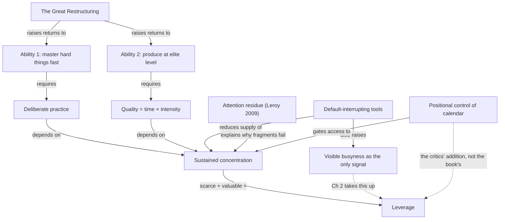

import { Aside, Badge, Card, CardGrid, Code, LinkCard, Steps, TabItem, Tabs } from '@astrojs/starlight/components';
import { Recall, Actions, Passage, Margin } from '@components';

{/* OUTLINE:START — generated by scripts/new-chapters.mjs from book.json. Do not edit by hand. */}
{/* THE BRIEF DECIDED THIS. Generation fills prose into it, and never invents it.

   book        Deep Work — Cal Newport
   chapter     1 · Deep work is valuable
   part        The idea — Say what deep work is, why it is valuable and why it is becoming rare.
   argues      The two abilities that make a knowledge worker valuable in this economy both require sustained concentration, so depth is an economic input rather than a preference.
   weight      load-bearing in the book's argument
   verdict     deep-dive
   estimate    30 min
   clarified   false

   clarified false, so the clarified-chapter section has been REMOVED from this
   file entirely. READ I is the original text. On familiar material a summary
   preserves the idea and deletes the machinery that made it actionable.

   gap         execution — reading will not fix a doing problem. Weight the actions, trim the explanation.

   The reader writes the recall section CLOSED BOOK, before reading the
   explanation layer, and fills the open-questions section by hand.
   Never write in either. */}
{/* OUTLINE:END */}

## Pre-context

Two terms are used from the first page as though they were already agreed, and the chapter never
stops to define either.

**Deep work** is Newport's own coinage, introduced in the book's preface rather than here:
professional activity performed in a state of distraction-free concentration that pushes cognitive
capability to its limit. The load-bearing word is *limit*. Work that is merely uninterrupted is not
deep by this definition — checking a spreadsheet for an hour with the door shut is uninterrupted and
shallow at the same time.

**The Great Restructuring** is Brynjolfsson and McAfee's phrase, not Newport's, and it arrives
without attribution in most editions. It names the claim that digital technology is not destroying
jobs uniformly but splitting the labour market: it multiplies the output of people who can work
with intelligent machines and erodes the position of people whose work the machines now do.

You also need the argument the chapter is answering. Through the 2010s the productivity literature
had converged on *responsiveness* — the manager who replies fastest, the team with the shortest
cycle time. This chapter is a rebuttal of that convergence, and it is written as one. If you read it
as neutral career advice you will miss that it is picking a fight.

<Margin label="Read before this">
Chapter 1 of *Deep Work* assumes you have read the preface. If you have not, the term it argues
about has not yet been defined for you.
</Margin>

## Core message

:::note[Core message]
The two abilities that decide who thrives in a restructured economy — learning hard things quickly
and producing at an elite level — both depend on a capacity that most knowledge work is actively
destroying.
:::

## Key points

The chapter rests on four claims, and they are not the same size.

1. **The economy is splitting three ways, not two.** The winners are high-skilled workers who can
   work *with* intelligent machines, superstars whose output is now distributable at zero marginal
   cost, and owners of capital. Everyone else is competing on price. This is the frame; everything
   else in the chapter is downstream of it.
2. **Two abilities decide which group you land in.** The ability to master hard things quickly, and
   the ability to produce at an elite level in both quality *and* speed. The second half of that
   second ability — speed — is the part almost every summary drops.
3. **Both abilities depend on the same underlying capacity.** Deliberate practice needs sustained
   attention on a specific skill; elite production needs sustained attention on a single task. The
   two abilities are not independent goods that happen to correlate.
4. **Attention residue is the mechanism, and it is the only empirical claim in the chapter.**
   Switching from task A to task B leaves part of your attention on A, so the *quality* of the work
   on B is reduced even though the *time* on B was not. This is Leroy 2009, and it is doing more
   work in this argument than a single study can carry.

The fourth is the one to hold onto, because it is the only one that could be wrong in a way you
could detect.

## Recall

<Recall minutes={10}>

Written closed-book, 2026-08-12, before reading anything below.

The argument as I have it: the economy now rewards two things — being able to learn a hard new
thing fast, and being able to produce a lot of high-quality output. Both need long uninterrupted
attention. Most jobs have destroyed long uninterrupted attention. Therefore the ability to
concentrate is becoming scarce at exactly the moment it becomes valuable, and scarcity plus value is
where leverage lives.

He uses a formula for high-quality work — something like quality equals time spent multiplied by
intensity of focus. The point of the formula is that you cannot fix a focus problem by adding hours.

The economic frame is three groups. I can remember two of them cleanly: people who work well with
machines, and superstars. The third I think is people who own the machines, but I am guessing.

Attention residue: when you switch tasks, some of your attention stays on the old one. I remember
the name of the effect and not the study behind it.

**Questions I could not answer:**

- Is "elite production" a claim about output volume or output quality? I have been reading it as
  quality and the formula implies both.
- Where does the 10,000-hour idea sit in this chapter — is he endorsing it or using it loosely?
- Does he ever say what the *floor* is? Is a 45-minute block deep work or not?

</Recall>

## The explanation layer

{/* SPINE:START — generated by scripts/new-chapters.mjs from book.json. Do not edit by hand. */}

### Where the author was standing

Newport wrote this in 2015 as a newly tenured associate professor of computer science at Georgetown,
with a research programme in distributed algorithms and a second career as a productivity writer
that had by then run for eleven years. Two features of that position shape the argument more than
anything in the text.

The first is that **his calendar was structurally unusual**. A tenured academic controls their own
week to a degree almost no other salaried professional does: teaching is fixed, everything else is
discretionary, and nobody schedules a meeting into your morning without asking. The book's central
manoeuvre — declare a block, defend it, let others adapt — is a manoeuvre he could actually make.
This predicts precisely where the argument bends: it will be strongest on *why* depth matters and
weakest on *how to obtain it when someone else owns your calendar*. Chapter 4 is where that bill
comes due.

The second is that **he was writing against a specific opponent**, and it was not distraction in
general. It was the mid-2010s consensus that responsiveness is the core professional virtue —
Slack had launched in 2013 and was the fastest-growing workplace product of the period, and open-plan
was still being defended as a collaboration technology. The polemical register of the chapter is
aimed at that consensus. Read a decade later, with the consensus already weakened, the argument can
seem to be shouting at something that is no longer standing.

There is a third thing, and it is the honest one: he had a book to sell into a crowded genre. The
three-group economic frame is doing rhetorical work as well as analytical work. It is not wrong, but
it is doing more than one job.

### What the author is actually saying

Stated more plainly than the chapter states it:

> Concentration used to be a *preference* — some people worked in long stretches, some in short
> ones, and the market was indifferent. Two changes have made it an *input*. First, the returns to
> being excellent at a hard thing have gone up, because a digital network lets one excellent person
> serve a market that used to need a hundred adequate ones. Second, the supply of people capable of
> sustained concentration has gone down, because the tools of knowledge work now interrupt by
> default. When the returns to a capacity rise and its supply falls, whoever still has it is holding
> something scarce.

That is the whole argument. Everything else in the chapter is either evidence for one of the two
changes or a worked example of somebody who noticed.

Note what it is *not* saying, because two things are commonly attributed to it here. It is not
saying that shallow work is worthless — Chapter 6 explicitly budgets for it. And it is not saying
that concentration is a personality trait you have or lack. The whole book is premised on it being
trainable, which is why Rule 2 exists.

### Where readers get confused

Four specific misreadings, each stated as the sentence a confused reader actually says.

**"So deep work means working long hours."** No — the formula is explicitly a product, not a sum.
`High-quality work = time spent × intensity of focus`. The reason the formula is in the chapter at
all is to make the point that a person working four intense hours beats a person working ten
distracted ones. Newport is on record elsewhere as a strict fixed-schedule worker who stops at 17:30.

**"Deep work means uninterrupted work."** Also no, and this is the more expensive error because it
feels correct. The definition requires that the work *push cognitive capability to its limit*.
Clearing an inbox with the door shut satisfies "uninterrupted" and fails the definition, which is
why Chapter 6's shallow-work budget is not a contradiction.

**"He is saying meetings are bad."** He is saying meetings are shallow, which is a claim about their
cognitive demand, not about their value. A one-hour meeting that unblocks four people is high-value
shallow work. The chapter simply refuses to let it be counted as depth.

**"The two abilities are two options."** They are presented as a pair you need both halves of. The
second — producing at an elite level — has a speed clause that is dropped in almost every secondary
summary of this chapter, and dropping it turns a demanding claim into a comfortable one.

### The teaching pass

The mechanism is attention residue, and it is worth building up from the study rather than from the
book's use of it.

Sophie Leroy's 2009 experiment did this. Participants worked on task A. Then, in one condition, they
were interrupted and moved to task B with A left unfinished; in another, they completed A first.
Immediately after the switch, she measured what was still occupying attention with a lexical
decision task — how fast you recognise words related to task A. The finding: people who switched
with A unfinished recognised A-related words faster, meaning A was still active, **and they
performed worse on B**.

The mechanism is a *carry-over of activation*, not a "warm-up cost". This matters because the two
predict different remedies. If it were a warm-up cost, longer blocks fix it by amortising a fixed
overhead. If it is carry-over, longer blocks help for a second reason: the residue decays, and a
long block gives it time to decay before the demanding part of the work begins.

Here is why that changes what you do. Consider two weeks with identical total hours:

| | Week A | Week B |
|---|---|---|
| Total working hours | 40 | 40 |
| Hours labelled "focus" | 20 | 20 |
| Longest contiguous focus block | 45 min | 3 h |
| Switches into and out of focus | 27 | 7 |

Under a warm-up model, Week A loses a fixed few minutes per switch — maybe two hours across the
week, unpleasant but survivable. Under a residue model, Week A also loses *quality* on every one of
those 27 blocks, and the loss does not show up as missing time. It shows up as work that took the
hours it was supposed to take and came out worse, which is the failure mode nobody attributes
correctly because there is nothing in the calendar to point at.

That is the chapter's real claim, and it is the reason a time audit alone will not find the problem.

<Passage at="Ch. 1, on the two core abilities">
The two core abilities for thriving in the new economy: the ability to quickly master hard things,
and the ability to produce at an elite level, in terms of both quality and speed.
</Passage>

### What real readers say

Searched 2026-09-04: the r/productivity and r/cscareerquestions threads that carry the book's title,
the Goodreads one- and two-star reviews sorted by most-liked, and the Hacker News submissions from
2016 and 2021.

The reaction splits cleanly by whether the reader controls their calendar, and the split is sharp
enough to be the main finding.

**Readers who found it obvious.** Repeated verbatim across the HN threads: some version of "this is
a blog post stretched to 300 pages". The complaint is almost always about Part 1 specifically —
which is where this chapter sits — rather than about the rules. Several commenters say they skipped
to Part 2 and lost nothing.

**Readers for whom the frame landed.** The recurring phrase is that it gave them *permission*
— language to defend a block to a manager, rather than a technique. This is a real and slightly
uncomfortable finding: the value reported is rhetorical, not procedural.

**Readers in reactive roles.** The sharpest negative reviews come from support, on-call, clinical
and client-service workers, and they are not disputing the chapter's claim. They are saying the
chapter's claim is true and unavailable to them, which is a different objection and a harder one.

**Where this is thin, and it is thin.** I found no longitudinal accounts — nobody writing "I did
this for two years, here is what happened". The genre does not produce them, so the absence is not
evidence about the book. It does mean the reader testimony available is entirely first-impression,
and first impressions on a book like this measure how well the argument was made rather than
whether it was right.

### What critics say

The strongest case against, argued as its proponents argue it.

**The exemplar selection is not incidental — it is the argument.** Newport's examples are Jung in a
stone tower, Carl Gauss, J.K. Rowling in a hotel, Bill Gates on Think Weeks, and academics with
tenure. Every one of them either owned their time or had bought it. A critic's version of this is
not "the examples are elitist"; it is stronger: *the availability of deep work is a function of
positional power, and a book that treats it as a function of individual discipline has misdescribed
its own subject.* On that reading, the chapter's advice is downstream of a structural fact it never
names, and telling an individual to concentrate harder is telling them to solve a bargaining problem
with a personal habit.

The steelman is genuinely hard to dismiss. Newport's own best answer — that depth is what *earns*
you the positional power in the first place — is a bootstrapping argument, and bootstrapping
arguments are exactly the kind that work for the person who already made it through.

**The economic frame is under-argued.** The three-group split is asserted with two pages and a
citation to *Race Against the Machine*. Labour economists have contested the polarisation thesis
substantially since — the "routine-biased technical change" literature is not settled, and the
hollowing-out pattern that was clear in 1990s US data is much weaker in 2010s data and looks
different again outside the US. The chapter reads as though the frame is established fact.

**One study is carrying the mechanism.** Leroy 2009 is a small laboratory study with an artificial
switch, and it is the entire empirical basis for the residue claim in a book that leans on that
claim throughout. This is the criticism with the most force, and it is not answered anywhere in the
book.

### What's been tested since

Three threads, and only one of them is comfortable for the chapter.

**Attention residue.** Leroy's original finding has held up in the sense that the effect has been
found again, including in a 2018 follow-up by Leroy and Glomb that looked at it in field conditions
rather than in the lab. What has not been established is the *size* of the effect in ordinary
knowledge work, or how long the residue takes to decay. The book implies both are large and
persistent; the literature does not say so. **Verdict: real, unquantified, and used past what it
supports.**

**Deliberate practice.** The chapter leans on Ericsson's framework for "mastering hard things
quickly". Macnamara, Hambrick and Oswald's 2014 meta-analysis across 88 studies put deliberate
practice at about 12% of variance in performance overall, and around 4% in professions — far from
the near-total account the popular version implies. This does not break the chapter's argument, but
it does mean "practise deeply and you will master it" is a much weaker claim than the chapter's
register suggests. **Verdict: the direction survives, the magnitude does not.**

**Multitasking and switch costs.** The general finding that task-switching carries a measurable cost
is one of the more robust results in cognitive psychology and has replicated widely. This is the
comfortable one. **Verdict: holds.**

The pattern is consistent: the *direction* of every claim in this chapter has survived; the
*magnitudes* the chapter implies have not been established, and in the deliberate-practice case have
been substantially reduced.

### How practitioners actually use it

What people who run this in organisations actually do, at stated scale.

**Team-level "no-meeting" blocks.** The commonest operationalisation, and the numbers reported are
consistent: two half-days a week, protected across a whole team of roughly 6–12 people, rather than
individually. Teams that ran it individually reported it collapsing within a quarter — the reason
given is always the same, that an individual block is a block someone else can still book over,
whereas a team block is a norm.

**Maker/manager split.** Engineering organisations of 50–200 typically run mornings as maker time
and afternoons as meeting time, enforced by a calendar policy rather than by individuals. The
failure mode at this scale is not distraction; it is that the policy holds for two quarters and then
erodes as headcount grows and new managers do not know the rule.

**The 90-minute unit.** Practitioners converge on 90 minutes as the working block, not the 3–4 hours
the book's exemplars use. The stated reason is that 90 minutes fits between existing recurring
meetings without needing to move them, which is a scheduling constraint rather than a cognitive
finding — worth knowing, because it is often cited as though it were the latter.

**Where it actually breaks.** In on-call and support rotations, every reported implementation
handles it the same way: not by protecting depth during the rotation, but by *alternating* — the
person on call does no deep work that week and gets it back the next. That is a rota design, not a
concentration technique, and it is the one adaptation the book does not contain.

### Where it doesn't transfer

The chapter's argument depends on four conditions. Where they hold, it goes through. Where they do
not, the mechanism it relies on is different, and this section describes the difference rather than
drawing a conclusion from it.

**Condition 1 — you have discretionary control over some hours.** The exemplars all did. Where a
role is defined by responsiveness — support, clinical, on-call, front-of-house, most client service
— the hours are not discretionary by design, and the book's manoeuvre of declaring and defending a
block is not available. What practitioners do instead is alternate at the rota level, described
above. That is a real mechanism and it is not in the book.

**Condition 2 — a labour market that pays a premium for depth.** The three-group frame is calibrated
on the US knowledge economy of the mid-2010s. In a market where the binding constraint on income is
the number of clients rather than the quality of output — which is the shape of a great deal of
professional work in South Asia, including much of the Kathmandu software and consulting market —
the return on the second ability (elite production) is compressed, while the return on the first
(learning hard things quickly) is if anything higher, because it is what moves you between markets.
The two abilities the chapter presents as a pair have quite different values under those economics,
and the chapter never separates them.

**Condition 3 — an environment where a closed door is legible.** The whole apparatus of signalling
unavailability assumes a workplace where "I am unavailable until 12" reads as professionalism rather
than as unavailability. In a household or an office where interruption is the ordinary texture of
respect and attention, the same signal carries a different meaning and costs something the book
never prices.

**Condition 4 — a life stage with contiguous hours in it.** Every exemplar in the chapter is a
person without a caregiving load. The chapter's unit of analysis is the multi-hour block, and where
the available units are 40 minutes, the residue mechanism is more binding rather than less — which
means the chapter's *diagnosis* applies with more force exactly where its *prescription* applies
with less.

### The version to hold

:::tip[The version to hold]
Concentration is an economic input rather than a preference, and the mechanism is that switching
costs you *quality* invisibly rather than *time* visibly — which is why you cannot find the problem
in a calendar. Hold that. Hold the two abilities as a pair, including the speed clause. Do not hold
the magnitudes: the residue effect is real and unquantified, the deliberate-practice account behind
"mastering hard things" is a fraction of what the popular version claims, and the three-group
economic frame is a contested thesis presented as settled. And carry the scar the critics leave —
the availability of depth is partly a function of positional power, so a chapter that reads as pure
individual advice is describing something it has not fully named.
:::

{/* SPINE:END */}

## Dialogue

### What I asked

If attention residue is real but its size is unmeasured, what would I expect to observe in my own
week if the effect were at the *low* end of plausible rather than the high end? I want the
observable difference, not the mechanism.

### What it said

At the low end, you would expect switching to cost you almost nothing on routine or well-practised
work, and to cost you visibly only on work that requires holding several constraints in your head
at once — the debugging session, the piece of writing where the structure is not yet decided. So the
prediction is that the damage is concentrated rather than spread: most of your fragmented week would
be fine, and a small number of specific tasks would be badly served by it.

At the high end, you would expect a diffuse quality loss across everything, and you would not be
able to point at which tasks suffered.

The distinguishing observation is therefore not "how much did I get done" but "was there a task this
week that I know came out worse, and did it happen to be the one I did in fragments".

### What I then argued

I put it that this makes the effect nearly unfalsifiable from the inside, because I have no
counterfactual: I cannot run the same task twice, once fragmented and once not, and the tasks that
suffer are exactly the tasks whose quality I am worst placed to judge.

### Where we ended up

Not resolved, and I think that is the correct place to stop. It conceded the falsifiability point
and offered the only workable substitute — that the observation has to be made on *inputs* rather
than outputs, i.e. did I give the hard thing a long block or not, since that at least is checkable.
I still think that quietly changes the claim from "fragmentation costs quality" to "give hard things
long blocks", which is a much weaker and much older piece of advice. It thinks the two are close
enough in practice. We did not converge, and the disagreement is the useful part.

## Concept map

## Actions

<Actions />

## The 30-second version

The economy pays more than it used to for two things — learning hard things fast and producing
excellent work quickly — and both run on a capacity that modern work destroys by default. The
mechanism is attention residue: switching leaves part of you on the last task, so fragmentation
costs you quality without costing you visible time. That is why you cannot find the problem by
looking at your calendar.

↔ [Ch 2 · Deep work is rare](/self-command/attention-dopamine-and-digital-discipline/deep-work/deep-work-is-rare/)
takes up the "visible busyness" edge above and asks why organisations produce it.
↔ [Ch 4 · Work deeply](/self-command/attention-dopamine-and-digital-discipline/deep-work/work-deeply/)
is where the positional-power objection has to be answered, and mostly is not.
↔ Every action here rolls up to [the ledger](/ledger/).

## Open questions

- Is "elite production" a claim about volume or quality? The formula says both and the prose says
  quality. I still do not know which he would defend.
- What is the floor? If 90 minutes is what practitioners actually run, is a 90-minute block deep
  work by his definition or a compromise with it — and does he ever say?
- The critics' point about positional power: is that an objection to the book or an addition to it?
  I have been treating it as an addition and I am not sure that is honest.

## Sources

| Claim | Source | Read on | Tier |
| --- | --- | --- | --- |
| Definition of deep work; the two core abilities; `quality = time × intensity` | *Deep Work*, Cal Newport, Grand Central 2016, Ch. 1 | 2026-08-12 | A — the book itself |
| The Great Restructuring; the three-group split | Brynjolfsson & McAfee, *Race Against the Machine*, 2011 — cited by Newport in Ch. 1 | 2026-08-12 | B — the book's own cited source, not independently read in full |
| Attention residue: switching with a task unfinished degrades performance on the next task | Leroy, S. (2009), "Why is it so hard to do my work?", *Organizational Behavior and Human Decision Processes* 109(2) — [doi:10.1016/j.obhdp.2009.04.002](https://doi.org/10.1016/j.obhdp.2009.04.002) | 2026-09-04 | A — primary study, abstract and method read |
| Deliberate practice accounts for ~12% of performance variance overall, ~4% in professions | Macnamara, Hambrick & Oswald (2014), *Psychological Science* 25(8) — [doi:10.1177/0956797614535810](https://doi.org/10.1177/0956797614535810) | 2026-09-04 | A — meta-analysis, abstract and effect sizes read |
| Reader reaction splits by calendar control; "a blog post stretched to 300 pages" | Hacker News submissions for *Deep Work* (2016, 2021); Goodreads 1–2★ sorted by most-liked | 2026-09-04 | C — public opinion, about the BOOK's reception and nothing else |
| Team no-meeting blocks survive where individual ones do not; 90 min as the practical unit | r/productivity and r/ExperiencedDevs threads; no single authoritative source | 2026-09-04 | C — practitioner report, uncontrolled, about practice rather than about the world |
