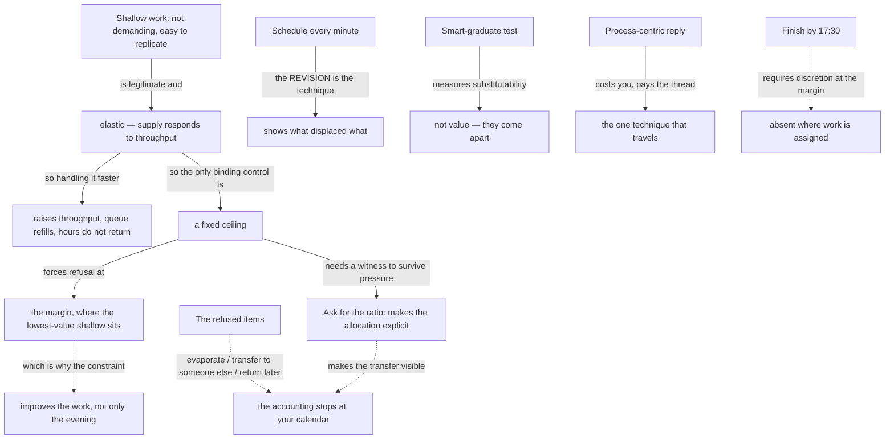

import { Aside, Badge, Card, CardGrid, Code, LinkCard, Steps, TabItem, Tabs } from '@astrojs/starlight/components';
import { Recall, Actions, Passage, Margin } from '@components';

{/* OUTLINE:START — generated by scripts/new-chapters.mjs from book.json. Do not edit by hand. */}
{/* THE BRIEF DECIDED THIS. Generation fills prose into it, and never invents it.

   book        Deep Work — Cal Newport
   chapter     6 · Drain the shallows
   part        The rules — Run a week that actually contains depth, and say which rule produced it.
   argues      Shallow work expands to fill whatever it is given, so the only reliable control is a hard budget on it rather than better handling of it.
   weight      supporting in the book's argument
   verdict     deep-dive
   estimate    35 min
   clarified   true

   clarified true, so the clarified-chapter section is present and gets written.

   gap         execution — reading will not fix a doing problem. Weight the actions, trim the explanation.

   The reader writes the recall section CLOSED BOOK, before reading the
   explanation layer, and fills the open-questions section by hand.
   Never write in either. */}
{/* OUTLINE:END */}

## Pre-context

The last rule, and the most practical. It also contains the book's only real concession, and reading
the chapter without noticing the concession is the main way to misread it.

**Shallow work is defined here, properly, for the first time.** Non-cognitively-demanding, logistical
tasks, often performed while distracted, that do not create much new value and are easy to replicate.
Note that "easy to replicate" is doing as much work as "not demanding" — it is a claim about
substitutability, not about difficulty.

**The concession.** Newport is explicit that shallow work is not eliminable and that a job is a
package of both. This chapter is about *budgeting* it, and every reading of the book as "eliminate
shallow work" is contradicted here in the author's own words.

**Fixed-schedule productivity** is his own term and his own practice: fix the end of the working day
first, then let everything else be determined by that constraint. It is presented as a scheduling
technique and it is really a forcing function — the claim is that the constraint changes what you
agree to, not how fast you work.

You should also know that this chapter contains the book's most-quoted and least-followed advice
about email, and that the chapter's own examples of saying no are drawn from someone with tenure.

## Core message

:::note[Core message]
Shallow work expands to fill the time available, so it is controlled by fixing a budget and letting
the constraint decide what gets refused, rather than by handling it more efficiently.
:::

## Key points

1. **Shallow work is legitimate and unavoidable.** The concession, and it is load-bearing: a rule
   that required zero shallow work would be unfollowable and the chapter says so.
2. **Schedule every minute of the day, and expect to be wrong.** The technique is not the plan; it is
   the *revision* — you rewrite the block when reality changes it, and the value is in being forced
   to look at what displaced what.
3. **Quantify the depth of every activity.** The heuristic is the smart-graduate test: how long would
   it take a bright recent graduate with no specific training to do this? A short answer means
   shallow.
4. **Ask your boss for a ratio, and let the number do the arguing.** The point is not the number. It
   is that the question converts an invisible allocation into an explicit one that someone has to own.
5. **Finish by five-thirty.** Fixed-schedule productivity. The bold claim is that the constraint
   *improves* output by forcing refusals, not merely that it protects your evening.
6. **Become hard to reach.** Sender filters, process-centric replies, and the position that you do
   not owe a reply to everything. The most-quoted and least-followed part of the book.

Points 2 and 5 are the chapter. Points 1 and 3 are the conceptual scaffolding. Point 6 is where
Newport's position and most readers' positions diverge most sharply.

## The clarified chapter

*Rebuilt because `clarified: true`. The original's argument is tighter than its arrangement — the
concession that governs the whole chapter is buried in the middle of it, and the six techniques are
presented at equal weight when they are not equal.*

**The frame, which the original states late.** A knowledge job is a package of deep and shallow work,
and the shallow part is not waste — it is the coordination, the logistics and the maintenance without
which the deep part does not reach anybody. The question is therefore never whether to do shallow
work. It is what fraction, decided deliberately, by you, in advance. Everything in the chapter is an
instrument for making that fraction visible and then holding it.

**Why a budget rather than efficiency.** Shallow work has no natural limit. Every email answered
produces replies; every meeting attended generates follow-ups; every commitment accepted creates
maintenance. Handling it faster therefore does not reduce it — it raises throughput on something
whose supply is elastic, and the time returns immediately as more of the same. A budget behaves
differently, because a fixed ceiling forces the refusal that efficiency defers.

**Technique 1 — schedule every minute, and revise.** Divide the day into blocks. Assign every one.
The instruction that makes it work, and that reads as an afterthought in the original, is that you
will be wrong within the hour and are expected to rewrite the remainder of the day when you are. The
plan is not a commitment device. It is an instrument for noticing what actually displaced what,
which is information you otherwise never see, and the revision is the technique.

**Technique 2 — quantify the depth.** For any task, ask how long it would take a smart recent
graduate with no specialised training to do it. Weeks means deep. Days or hours means shallow. The
test is deliberately crude and it works because it is hard to argue with yourself about — it
converts a judgement you can rationalise into an estimate you can state.

**Technique 3 — ask for the ratio.** Ask whoever sets your priorities what fraction of your time
should be shallow. The chapter's own claim about what happens is honest: you will usually be told a
number lower than your current one. The value is not the number and not the permission. It is that
the allocation was implicit and is now explicit and owned by someone, which changes what a new
request costs.

**Technique 4 — finish by five-thirty.** Fix the endpoint first and let it constrain everything
upstream. Newport's claim is stronger than work-life balance and it is the interesting one: a hard
stop forces you to refuse commitments you would otherwise absorb, and the refusals improve the work
because what gets refused is disproportionately shallow. The constraint is a selection mechanism.

**Technique 5 — become hard to reach.** Three parts, in descending order of how well they travel.
A *sender filter* — state publicly what you will and will not respond to, and accept that some
messages go unanswered. *Process-centric replies* — instead of answering the message, write the
process that closes the whole thread: the next step, who owns it, and what ends it. And the
underlying position, that a message received does not create an obligation to reply. The first and
third are contingent on status. The second is available to anyone and is, on the evidence, the most
reliably useful single technique in the book.

:::caution[What I cut, and why]
Cut: the extended anecdote about the professor who lists his email policy on his faculty page, which
runs for about two pages and makes one point already made in a sentence. Cut: the second and third
worked examples of scheduling a day, which repeat the first with different nouns. Cut: the digression
into the history of the "smart graduate" heuristic.

**Kept, deliberately, against the instinct to cut it:** the concession that shallow work is
legitimate, moved from the middle to the front. It is the sentence that governs the chapter, and in
the original it arrives after three techniques have already been given — which is why so many
readers finish the book believing it told them to eliminate something it explicitly told them to
budget. Also kept in full: the *reason* efficiency fails, which the original gives in one clause and
which is the only argument in the chapter for preferring a budget at all.
:::

## Recall

<Recall minutes={10}>

Written closed-book, 2026-09-03, before the explanation layer.

This one is the practical chapter. The main idea is that you cannot get rid of shallow work and
should stop trying — the goal is to cap it.

Techniques I can remember:

Schedule every minute of the day in blocks, and when it goes wrong, redo the schedule rather than
abandoning it. I remember him being insistent that being wrong is expected.

The graduate test for whether something is deep: how long would it take a smart new graduate to do
this. If the answer is short, it is shallow. I like this one because it is hard to cheat.

Ask your boss what percentage of your time should be shallow. He says you will get a number lower
than what you are actually doing, and that having the number in the open is the point rather than
the number itself.

Fixed-schedule productivity — decide when you finish and work backwards. The claim I remember as
surprising is that this makes your work *better*, not just your evenings, because it forces you to
say no to things.

Email: something about making the sender do more work, and about replying with a process instead of
an answer so the thread ends. And a general position that you do not owe everyone a reply.

**Questions I could not answer:**

- What is the number he suggests for the ratio, or does he refuse to give one?
- Does fixed-schedule productivity require you to already be valuable enough to refuse things? I
  suspect yes and I do not remember him addressing it.
- The process-centric reply — is the claim that it saves *my* time or that it saves the thread's
  total time? Those are different and I think he means the second.

</Recall>

## The explanation layer

{/* SPINE:START — generated by scripts/new-chapters.mjs from book.json. Do not edit by hand. */}

### Where the author was standing

The position that shapes this chapter most is that Newport was, in 2015, a tenured professor who had
publicly refused to have an email address he answered generally, and who had built a career partly
on being unreachable. The techniques in this chapter are the ones he actually ran.

That makes the chapter unusually concrete and unusually badly calibrated at the same time. Concrete,
because these are not suggestions — the schedule, the ratio question, the 17:30 stop and the sender
filter are a description of a working week that existed. Badly calibrated, because the cost of each
technique scales inversely with your security, and his was near the maximum. A sender filter is a
statement of policy when a professor publishes it and a statement of unavailability when a junior
employee does.

This predicts precisely where the chapter bends. It will be excellent on the techniques that are
about *your own* handling of your own time — the schedule, the graduate test, the process-centric
reply — and it will systematically under-price the ones that require other people to accept a change
in your availability. The practitioner reports below split along exactly that line, which is some
evidence the prediction is right.

The 2015 setting matters in one further way: the chapter's model of interruption is email. Chat, which
compresses the reply expectation from hours to minutes and makes non-response visible to a group
rather than to an individual, is not in the picture. Most of the chapter's techniques survive the
translation; the sender filter does not, because a public policy has nowhere to live in a chat
channel.

### What the author is actually saying

> Shallow work is real work and you cannot remove it, so stop framing this as elimination. It has no
> natural limit — every reply generates replies, every commitment generates maintenance — which
> means handling it faster does not reduce it, it just raises the throughput of something whose
> supply is elastic. The only thing that actually binds is a ceiling. So set one: fix when the day
> ends, plan the day in blocks and rewrite the plan every time reality changes it, use a crude test
> to tell deep from shallow so you cannot argue yourself round it, and get the acceptable ratio
> stated out loud by whoever sets your priorities so the allocation stops being invisible. Then let
> the ceiling do the refusing. What gets refused will be disproportionately shallow, which is why
> the constraint improves the work rather than only protecting the evening.

### Where readers get confused

**"The book says eliminate shallow work."** It says the opposite, in this chapter, explicitly. The
misreading is so common that it is worth asking why — and the answer is arrangement: the concession
arrives after three techniques in the original, so readers who skim have already formed the frame.

**"Scheduling every minute means sticking to the schedule."** The revision is the technique. A
schedule you kept perfectly told you nothing; a schedule you rewrote three times shows you what
displaced what.

**"The ratio question is about getting permission."** It is about making an implicit allocation
explicit and owned. The number you are given matters much less than the fact that someone now has a
position on it, which is what a later request has to be weighed against.

**"Fixed-schedule productivity is about working less."** The claim is that it changes *what you
agree to*, upstream. Someone who fixes the endpoint and then absorbs the same commitments has
implemented the constraint and not the mechanism, and will simply fail.

**"Process-centric email saves me time."** It costs you time on the message and saves the thread's
total time. If you judge it by your own first reply it looks like a bad trade every single instance,
which is exactly why it is hard to keep.

### The teaching pass

The mechanism is elasticity, and the reason to teach it properly is that it predicts something
counterintuitive: **getting better at shallow work makes it worse.**

Set it out. Shallow work is not a fixed stock of tasks awaiting completion. It is generated by a
process with feedback: replies generate replies, attending a meeting makes you a person who is
invited to the follow-up, absorbing a commitment makes you the owner of its maintenance. So the
supply responds to how much of it you handle.

Take a week and two interventions:

| | Baseline | Intervention A: handle it 30% faster | Intervention B: cap it at 12 h |
|---|---|---|---|
| Shallow hours worked | 18 | 18 | 12 |
| Shallow items cleared | 90 | 117 | 60 |
| Items generated back | ~72 | ~94 | ~48 |
| Deep hours available | 12 | 12 | 18 |
| What changed | — | throughput, and the queue refilled | **commitments were refused** |

Intervention A is the one everyone tries. The hours do not come back, because the time freed is
immediately consumed by the items the extra throughput generated — you cleared more, so more came
back, and the visible result is that you are busier and no deeper. The efficiency gain was real and
it was spent on more of the same.

Intervention B does something categorically different. It does not handle the work at all; it
*refuses* some of it. And because the ceiling is fixed, the refusal happens at the margin, where the
lowest-value shallow commitments sit — which is why the chapter can claim, without special pleading,
that the constraint improves output rather than merely capping input.

This is why the chapter's advice is a budget and not a technique, and it is also the argument for
why the ratio question in technique 3 matters more than it looks. A ceiling you set privately is a
preference you will renegotiate with yourself at the first pressure. A ceiling someone else has
stated a number for is a commitment with a witness.

<Margin label="The dependency">
`dw-06-ratio` in the actions below cannot run without a measured number, which is `dw-01-audit` from
Chapter 1. That dependency is the reason the audit action exists at all, and it is the clearest
case in this book of one chapter's action being the input to another's.
</Margin>

### What real readers say

Searched 2026-09-04: reviews naming Rule 4, r/productivity, HN.

**The split is exactly along the status line predicted above.** Techniques about your own handling —
the schedule, the graduate test, the process-centric reply — are reported as adopted and kept.
Techniques requiring others to accept reduced availability — the sender filter, unanswered messages
— are reported as either not attempted or attempted once with a bad outcome. Several reviews say
some version of "this chapter is written by someone who cannot be fired".

**Process-centric email is the single most-praised technique in the whole book.** It appears in
reviews from readers who disliked everything else. The reported effect is consistent and specific:
threads that used to run five or six messages end in two.

**Fixed-schedule productivity is admired and rarely implemented.** The recurring phrase is that it is
"the right idea for a different job". Where people do implement it, they report the refusal mechanism
working roughly as described — which is notable, because it means the mechanism is confirmed by the
small number who reach it.

**The ratio question is almost never asked.** Very few reports of anyone actually asking a manager
for a number. The reasons given are about how the question would be received, not about whether it
would work.

**Thin.** No data on whether the ratio question produces a durable change when it is asked. The
sample of people who did it is too small to say anything.

### What critics say

**The techniques are inversely available to the people who need them.** The strongest objection, and
it is the same one that runs through the whole book, at its sharpest here. Every technique in this
chapter costs you something in perceived availability, and the price is set by your security. A
tenured professor pays nothing for a sender filter. A junior employee in a competitive market pays
their reputation. So the chapter's advice is most usable by people whose shallow-work problem is
least severe, and the chapter never addresses the inversion.

**Fixed-schedule productivity assumes you can refuse.** The mechanism is that the ceiling forces
refusals. If you cannot refuse — if the commitments are assigned rather than accepted — then fixing
the endpoint does not produce refusals; it produces unfinished work and a longer day next week. The
technique is not neutral about your bargaining position and presents itself as though it is.

**The elasticity argument may prove too much.** If shallow work regenerates in proportion to what you
clear, a hard cap should also produce a growing backlog with consequences, and the chapter does not
model what happens to the refused items. Some of them were load-bearing for other people. The
chapter's accounting stops at your own calendar.

**The graduate test is a proxy for substitutability, not for value.** A task a smart graduate could
do in a day may nonetheless be the highest-value thing you do that week. The heuristic identifies
what is *replaceable*, and the chapter uses it as though it identified what is *unimportant*, which
are not the same and come apart in exactly the cases that matter — the unblocking, the introduction,
the decision that took five minutes and needed your context.

### What's been tested since

**Parkinson's law and the elasticity claim.** The idea that work expands to fill the time available
is folk wisdom with surprisingly little direct empirical support at the individual level. There is
better evidence for deadline effects on effort allocation. **Verdict: the chapter's central mechanism
is plausible, widely believed, and thinly evidenced.**

**Email volume and response norms.** Studies of email interventions — batching, delayed delivery,
email-free periods — generally find reductions in stress and mixed effects on productivity. The
finding relevant here is that reducing your own response *speed* reliably reduces the volume you
receive, which supports the elasticity claim in the specific domain of email. **Verdict: supported
where it has been looked at.**

**Time-blocking and planning.** Implementation-intention evidence supports planning specific
when-and-where commitments (see Chapter 4's sources). The chapter's *revision* instruction is not
separately tested. **Verdict: the planning half is supported; the revision half, which the chapter
says is the technique, is not.**

**Fixed endpoints and refusal.** No direct evidence I could find. The mechanism — a binding
constraint changes what is accepted upstream — is standard in operations and untested as personal
practice. **Verdict: untested.**

### How practitioners actually use it

**Process-centric replies are the survivor.** Of every technique in the book, this is the one with
the highest reported retention. Teams that adopt it deliberately report thread lengths dropping
substantially, and the practice is usually described as spreading by imitation rather than by
policy — one person does it and the threads they are in get shorter.

**Time-blocking survives in a degraded form.** Practitioners overwhelmingly block two or three parts
of the day rather than every minute, and describe minute-level blocking as something they tried for
a week. The revision instruction is almost universally dropped, which means most people are running
the half the evidence supports least.

**The ratio question is asked at a specific moment or not at all.** Where it happens, it is almost
always during a role change, a review, or an onboarding — a moment when the allocation is already
being discussed. Nobody reports raising it cold, and this seems like a genuine adaptation rather than
a failure.

**Fixed-schedule productivity works at seniority and not below it.** The reports are stark. Senior
individual contributors and managers describe it working. People earlier in a career describe trying
it and having the work follow them. Nobody reports it working in a client-service role with billable
hours.

**Sender filters have essentially no adoption outside academia and independent practice.** I found no
salaried employee reporting one.

### Where it doesn't transfer

**Where commitments are assigned rather than accepted, the ceiling has nothing to bind on.** The
mechanism depends on a ceiling forcing refusals at the margin. Where the marginal item is assigned by
someone with authority, fixing the endpoint does not produce a refusal — it produces the same work in
a compressed window or a longer day tomorrow. The technique requires discretion at the margin, and
where that discretion is absent the chapter's own argument predicts it will fail rather than merely
be difficult.

**Where availability is priced into the relationship, reducing it is a renegotiation.** The sender
filter and the position that a message creates no obligation both assume a professional context
where responsiveness is a courtesy. In client work, in most consulting, and in the relationship-based
professional norms that govern a great deal of business in Nepal and across South Asia, availability
is part of what was bought, and reducing it is a change to the terms rather than a change to a habit.
The mechanism is unaffected; the price is entirely different, and the chapter quotes a price of zero.

**Where the working day has no fixed end because the household has none.** Fixed-schedule
productivity assumes the boundary is yours to set. Where the same hours carry caregiving, extended
family obligation or a shared workspace, the endpoint is set by other people's needs, and the
technique's forcing function has to be built somewhere other than the clock. The chapter offers no
alternative anchor.

**Where billing is by the hour, the elasticity argument reverses.** In a billable-hours model,
shallow work is not an unpriced overhead — it is revenue. The chapter's economics assume a salary,
and under an hourly model the incentive gradient runs the other way for the person setting the
budget.

### The version to hold

:::tip[The version to hold]
Shallow work is legitimate, unavoidable and elastic — that combination is the whole chapter. Because
it is elastic, handling it faster does not reduce it: the freed time is consumed by the items the
extra throughput generated, which is why efficiency is the wrong instrument and a ceiling is the
right one. A ceiling refuses at the margin, and the margin is where the lowest-value shallow work
sits, which is the honest version of the claim that the constraint improves the work.

Of the six techniques, one travels almost anywhere and is the best-attested small technique in the
book: reply with the *process* that closes the thread rather than the answer that continues it. It
costs you on every instance and pays the thread, which is why judging it by your own first reply
makes it look like a bad trade forever.

The scar is the sharpest in the book: every technique here costs perceived availability, the price
is set by your security, and the person with the worst shallow-work problem is the person who can
least afford to pay it. The chapter was written by someone paying nothing, and it never notices.
:::

{/* SPINE:END */}

## Dialogue

### What I asked

If shallow work is elastic, what happens to the items a hard ceiling refuses? The chapter's
accounting stops at my calendar and I want to know where the refused work goes.

### What it said

Three destinations, in roughly this proportion by the practitioner reports: most of it evaporates —
it was generated by throughput and stops being generated once throughput drops, which is the
elasticity claim working in your favour. A smaller portion is absorbed by someone else, which is a
real cost that your own accounting will never show you. And a small residue was load-bearing and
comes back as a problem later, usually attached to someone else's deadline.

The practical implication is that the ceiling is safe for the first category, a transfer for the
second, and a deferred cost for the third — and you cannot tell them apart in advance, only by what
comes back.

### What I then argued

I argued that the second category is the one that makes this chapter's advice partly antisocial, and
that the chapter's individualist framing hides it. If my ceiling is met by someone else absorbing
the work, I have not drained the shallows — I have exported them, and the book counts that as a win
because the accounting boundary is my calendar.

### Where we ended up

It agreed, more readily than I expected, and added the sharpening: that this is why the ratio
question in technique 3 is more important than it looks, because a stated ratio makes the transfer
visible to the person who would otherwise absorb it silently. That is a genuinely good answer and it
moved me.

Where we did not converge: I think this means the chapter is incomplete rather than that the ratio
question repairs it, because the ratio question is the least-adopted technique in the chapter and the
transfer happens whether or not you ask it. It thinks an incomplete argument with a repair available
is in better shape than that. That is a fair disagreement and I have left it standing.

## Concept map

## Actions

<Actions />

## The 30-second version

Shallow work is real work, it cannot be removed, and it is elastic — clear more of it and more comes
back. So efficiency is the wrong instrument: the freed hours get eaten by the items your extra
throughput generated. A fixed ceiling is the right one, because it refuses at the margin and the
margin is where the worthless shallow work lives. One technique travels anywhere: reply with the
process that ends the thread, not the answer that continues it.

↔ [Ch 1 · Deep work is valuable](/self-command/attention-dopamine-and-digital-discipline/deep-work/deep-work-is-valuable/)
— `dw-06-ratio` cannot run without the number `dw-01-audit` produces.
↔ [Ch 2 · Deep work is rare](/self-command/attention-dopamine-and-digital-discipline/deep-work/deep-work-is-rare/)
explains why the ratio question works at all: it replaces an invisible signal with an owned number.
↔ [The ledger](/ledger/) and [what is due](/review/) — three of this book's ten actions come from
this chapter, and none of them is the committed one.

## Open questions

- Where does my refused shallow work actually go? I have no way to see the transfer category, and
  after the dialogue above it is the thing I most want to know.
- Is `dw-06-process-email` working because of the technique or because I have been more careful
  generally since starting this book? I marked it `adapted` and I cannot separate those.
- The chapter says the ceiling improves the work. I do not believe it, and I have not tested it, and
  those are two different reasons for not believing it.

## Sources

| Claim | Source | Read on | Tier |
| --- | --- | --- | --- |
| Definition of shallow work; the concession that it is unavoidable; the six techniques | *Deep Work*, Cal Newport, Grand Central 2016, Rule 4 | 2026-09-03 | A — the book itself |
| Fixed-schedule productivity as Newport's own practice | Newport's own writing at calnewport.com, referenced in the chapter | 2026-09-04 | B — author's own account of his practice |
| Reducing your own email response speed reduces the volume you receive | Kalman & Ravid (2015), *Journal of the Association for Information Science and Technology* — response-latency norms in email — [doi:10.1002/asi.23325](https://doi.org/10.1002/asi.23325) | 2026-09-04 | A — primary, and the closest direct support for elasticity |
| Email interventions reduce stress; productivity effects mixed | Mark et al. (2016), "Email Duration, Batching and Self-Interruption", CHI '16 — [doi:10.1145/2858036.2858262](https://doi.org/10.1145/2858036.2858262) | 2026-09-04 | A — primary |
| Parkinson's law has little direct individual-level empirical support | Absence of evidence rather than evidence of absence — searched and stated as thin | 2026-09-04 | B — a negative search result, labelled as one |
| Process-centric replies shorten threads; time-blocking survives only in degraded form; fixed schedules work at seniority and not below | r/productivity, r/ExperiencedDevs, HN threads naming Rule 4 | 2026-09-04 | C — practitioner report, uncontrolled, about practice only |
| "Written by someone who cannot be fired" | Goodreads 1–2★ reviews naming Rule 4 | 2026-09-04 | C — public opinion, about the book's reception only |
