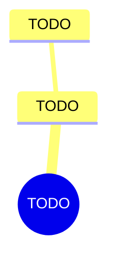

import { Aside, Badge, Card, CardGrid, Code, LinkCard, Steps, TabItem, Tabs } from '@astrojs/starlight/components';
import { Recall, Actions, Passage, Margin } from '@components';

{/* FIVE RULES THAT BREAK EVERY FIRST DRAFT. All five are in md-spec.md.

    1. MDX has no HTML comments. A comment is a brace, a slash, a star ... a
       star, a slash, a brace. AND A LITERAL STAR-SLASH INSIDE ONE CLOSES IT
       EARLY, which is how this exact line broke the sibling project's build.
    2. A bare < or { in prose is SYNTAX, not text. Put it in backticks.
    3. Blank lines around a component's inner content, or the Markdown inside
       it is not parsed as Markdown. Silent: it renders, just wrongly.
    4. The paste fence is FOUR backticks. This file contains three-backtick code
       blocks, and a three-backtick wrapper closes on the first one.
    5. Internal links are ROOT-ABSOLUTE. A relative ../ chain is a hard build
       error, never resolved. Paths are in src/generated/book-slugs.md. */}

{/* OUTLINE:START — generated by scripts/new-chapters.mjs from book.json. Do not edit by hand. */}
{/* THE BRIEF DECIDED THIS. Generation fills prose into it, and never invents it.

   book        Deep Work — Cal Newport
   chapter     6 · Drain the shallows
   part        The rules — Run a week that actually contains depth, and say which rule produced it.
   argues      PLACEHOLDER — the claim this chapter makes, in one line.
   weight      supporting in the book's argument
   verdict     deep-dive
   estimate    35 min
   clarified   true

   clarified true, so the clarified-chapter section is present and gets written.

   gap         execution — reading will not fix a doing problem. Weight the actions, trim the explanation.

   The reader writes the recall section CLOSED BOOK, before reading the
   explanation layer, and fills the open-questions section by hand.
   Never write in either. */}
{/* OUTLINE:END */}

## Pre-context

TODO — what you need to have in mind before opening this chapter. Not a summary of it.

## Core message

:::note[Core message]
TODO — one sentence. If it takes two, the chapter has two messages and the brief should say so.
:::

## Key points

TODO — the load-bearing claims, not a précis.

## The clarified chapter

{/* OMIT THIS WHOLE SECTION when the frontmatter says clarified: false.
    On familiar material the original is the better text, and a summary
    preserves the idea while deleting the machinery that made it actionable. */}

TODO

<Aside type="note" title="What I cut, and why">
TODO — what the original had that this does not, and why it was safe to drop.
</Aside>

## Recall

<Recall minutes={10}>

TODO — **you** write this. Book shut, page collapsed, assistant off, BEFORE reading the
explanation layer below.

Then: the questions you could not answer.

</Recall>

## The explanation layer

{/* SPINE:START — generated by scripts/new-chapters.mjs from book.json. Do not edit by hand. */}

### Where the author was standing

{/* Who they were, when, what problem they were living inside, what they were reacting against — and what that predicts about where the argument bends. NOT biography, and it never explains the argument away. */}

TODO

### What the author is actually saying

{/* The argument, stated more plainly than the chapter states it. */}

TODO

### Where readers get confused

{/* The specific misreadings, not "some find it difficult". */}

TODO

### The teaching pass

{/* The mechanism, taught rather than summarised. */}

TODO

### What real readers say

{/* From actual threads. If it is thin, SAY SO — never manufacture consensus. */}

TODO

### What critics say

{/* The strongest case against, argued properly. */}

TODO

### What's been tested since

{/* Replication, later evidence, what has failed to hold. */}

TODO

### How practitioners actually use it

{/* What people who operate this do, at a stated scale. */}

TODO

### Where it doesn't transfer

{/* Where the CLAIM'S CONDITIONS differ — economics, institutions, country, stage of life. Describe the difference; never conclude that it therefore does not apply to him. That conclusion is his, and it belongs with the recall. ADD, never subtract. */}

TODO

### The version to hold

{/* The synthesis. What survives all nine sections above. */}

TODO

{/* SPINE:END */}

## Dialogue

{/* THE ORDER IS THE POINT. Question first, position second, and the page must
    show them that way round — sycophancy is triggered by conveying a belief,
    so a position stated before the answer makes that answer suspect. */}

### What I asked

TODO

### What it said

TODO

### What I then argued

TODO

### Where we ended up

TODO

## Concept map

## Actions

<Actions />

## The 30-second version

TODO — what you would say about this chapter in a lift.

## Open questions

{/* LEFT EMPTY DELIBERATELY. The AI never writes here. Questions you could not
    answer are the highest-value note anyone keeps and the ones nobody records;
    this section exists to make you record them. */}

## Sources

| Claim | Source | Read on | Tier |
| --- | --- | --- | --- |
| TODO | TODO | TODO | TODO |
