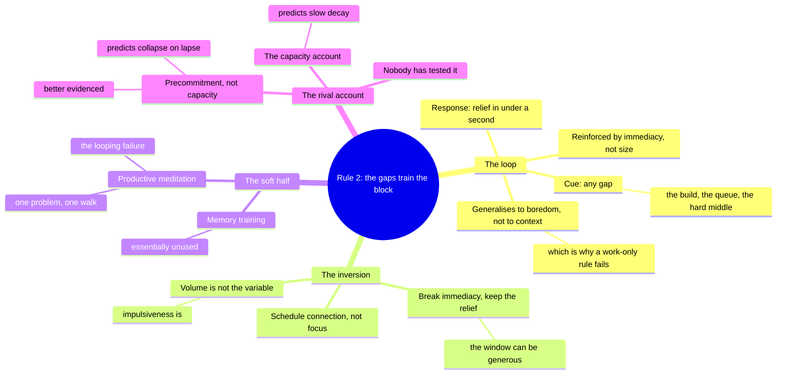

import { Aside, Badge, Card, CardGrid, Code, LinkCard, Steps, TabItem, Tabs } from '@astrojs/starlight/components';
import { Recall, Actions, Passage, Margin } from '@components';

{/* OUTLINE:START — generated by scripts/new-chapters.mjs from book.json. Do not edit by hand. */}
{/* THE BRIEF DECIDED THIS. Generation fills prose into it, and never invents it.

   book        Deep Work — Cal Newport
   chapter     5 · Embrace boredom
   part        The rules — Run a week that actually contains depth, and say which rule produced it.
   argues      The capacity for concentration is trained by what you do in the gaps, so scheduling distraction rather than scheduling focus is the lever.
   weight      load-bearing in the book's argument
   verdict     deep-dive
   estimate    30 min
   clarified   false

   clarified false, so the clarified-chapter section has been REMOVED from this
   file entirely. READ I is the original text. On familiar material a summary
   preserves the idea and deletes the machinery that made it actionable.

   gap         execution — reading will not fix a doing problem. Weight the actions, trim the explanation.

   The reader writes the recall section CLOSED BOOK, before reading the
   explanation layer, and fills the open-questions section by hand.
   Never write in either. */}
{/* OUTLINE:END */}

## Pre-context

This is the chapter that inverts the book, and if you read it as more advice about focusing you will
miss the inversion entirely.

Rule 1 was about the block. This one says the block is not where the problem lives. The claim is
that the capacity to concentrate is *trained by what you do when you are not concentrating*, so the
lever is not the deep hours — it is the shallow ones.

Two things to have in your head.

**The rewiring premise.** The chapter asserts that constant switching does not merely occupy
attention in the moment but degrades the capacity for sustained attention over time. Newport draws
on Clifford Nass's Stanford work on chronic media multitaskers here. The premise is stronger than
"distraction is bad now" and it is what makes the chapter's recommendation follow.

**Scheduled distraction, not scheduled focus.** The central instruction, and it is deliberately the
inverse of what everyone expects. You do not schedule blocks of internet abstinence around a default
of connection. You schedule blocks of internet *use* around a default of disconnection, and the
gaps between them are not breaks from the internet — they are the training.

The other two techniques in the chapter — productive meditation and memory training — are much
weaker and Newport is noticeably less confident about them. Do not weight them equally.

## Core message

:::note[Core message]
Concentration is a trained capacity rather than a fixed one, and it is trained or degraded in the
gaps, so the intervention that matters is on how you spend the time you are not working deeply.
:::

## Key points

1. **Switching is training, not just cost.** Every time you relieve boredom with a tap, you rehearse
   the thing you are trying to stop doing. This is the claim the chapter turns on, and it is much
   stronger than the attention-residue claim from Chapter 1 — residue is about the current task;
   this is about the capacity itself.
2. **Therefore schedule the distraction, not the focus.** Fixed windows of internet use, with
   disconnection as the default between them. The inversion is the whole recommendation.
3. **The rule applies outside work, and that is the point.** Being offline at your desk and
   scrolling in every queue trains the same reflex. The chapter is explicit that a work-only version
   does not work, and this is the part readers most often drop.
4. **Productive meditation.** Take one defined problem into a walk. Notice wandering; restart.
   Presented as a technique with a learning curve; evidenced by almost nothing.
5. **Memory training.** Card memorisation as attention training. This is the weakest thing in the
   book and the chapter half-admits it.

Claims 1–3 are one argument and it is a good one. Claims 4 and 5 are separate and much softer.

## Recall

<Recall minutes={10}>

Written closed-book, 2026-09-01.

The core idea, which I found genuinely surprising the first time: it is not enough to remove
distraction while you are working, because the distraction outside the block is what makes you bad
at the block. Every time you reach for the phone in a queue you are practising being unable to
tolerate a gap.

So the instruction is backwards from what you would expect. Instead of scheduling focus time you
schedule internet time — you have specified windows when you are online and the default the rest of
the time is offline. And crucially this applies at home too, not just at work, because it is the
same capacity.

There's a point about how this is not about the total amount of internet use. You can schedule a lot
of online time and it still works, because the mechanism is about whether you switch *on impulse*,
not about how many hours. That felt like the important detail.

Productive meditation: you take a single problem, go for a walk, and work on it mentally, bringing
yourself back when you drift. He says expect to be bad at it. There is something about looping — you
keep re-solving the same easy part instead of pushing to the hard part.

Memory training with cards. I remember it is there and I do not remember why.

**Questions I could not answer:**

- What is the evidence that the capacity is actually trainable in this direction? I remember the
  claim and no study.
- If I schedule an online window and then use it badly, does that count as training the bad reflex
  or not? The mechanism as I understand it says the switching is the problem, not the being online.
- Is productive meditation supposed to produce the answer to the problem, or to train attention with
  the problem as material? I have read it both ways.

</Recall>

## The explanation layer

{/* SPINE:START — generated by scripts/new-chapters.mjs from book.json. Do not edit by hand. */}

### Where the author was standing

The relevant fact is that Newport had never had a social media account, and had been writing about
that publicly for years before this book. He is not describing a habit he broke; he is describing
one he never formed.

That produces the chapter's greatest strength and its main blind spot, and they are the same
feature. The strength is that he can see the *default* clearly. Someone inside the habit experiences
each check as a response to something — a notification, a lull, a question. From outside, the
pattern is visible as a trained reflex with a trigger, which is exactly the framing the chapter
needs and exactly what makes it the most original chapter in the book.

The blind spot is the cost of the transition. The chapter treats moving from impulse-checking to
scheduled use as a matter of adopting a rule. For someone whose reflex is a decade old and whose
social ties are partly maintained through the channel being restricted, it is a withdrawal with a
social cost, and the chapter prices neither. This predicts where the argument bends: it will be
excellent on the mechanism and thin on the transition, and the practitioner reports below say
exactly that.

It is also worth noting the date. In 2015 the reflex was pull-to-refresh on a feed. The
recommendation — schedule the windows — assumes an activity you go *to*. Short-form video and the
notification-driven pattern that followed are better described as something that comes to you, which
does not break the mechanism but does mean the chapter's specific remedy is aimed at a slightly
older shape of the problem.

### What the author is actually saying

> The reason you cannot concentrate for three hours is not that you have not tried; it is that you
> have spent years training the opposite reflex, and you did most of that training outside work. Any
> moment of boredom that you relieve with a tap is a repetition. So the intervention has to be on
> the gaps rather than on the blocks. Do not treat connection as the default and carve out islands
> of focus. Treat disconnection as the default and schedule the islands of connection — then keep to
> the schedule even when the impulse arrives with a good reason attached, because the reason is not
> the point. The point is that you did not switch on impulse. And do this at home too, because it is
> one capacity and it does not distinguish work from a queue.

The subtlety that makes the recommendation workable, and that most summaries lose: **the amount of
online time is not the variable.** You can schedule a great deal of it. What is being trained is
whether the switch is impulsive or scheduled, so a person with five hours of scheduled internet a
day is complying and a person with twenty minutes of impulsive checking is not.

### Where readers get confused

**"So I have to use the internet less."** No, and this is the most consequential misreading of the
chapter. The variable is impulsiveness, not volume. A generous schedule kept faithfully trains the
capacity; a small amount taken on impulse does not.

**"I'll do this at work."** The chapter explicitly says a work-only version does not work, because
the capacity does not know it is at work. This is the most commonly dropped instruction and dropping
it removes most of the mechanism.

**"Productive meditation is meditation."** It is not, and the name is unhelpful. There is no
attention to the breath and no non-judgemental awareness. It is deliberate practice at holding a
structured problem in working memory, which is a different activity that happens to share the
posture.

**"If I get an idea mid-block I should not act on it."** The chapter's rule is about *switching
channels*, not about capturing. Writing it on a card and continuing is exactly compliant — the card
exists so that the urge has somewhere to go that is not the switch.

**"Boredom is the training."** Nearly, and the precise version matters: it is *not relieving* the
boredom that is the training. Boredom you distract yourself out of trains nothing.

### The teaching pass

The mechanism is a conditioning claim, and the useful move is to state it precisely enough to see
what would falsify it.

The claim is not that distraction wastes time. It is that **the pairing of a boredom cue with an
immediate relief response strengthens that pairing**, and that the pairing generalises to any
context where boredom occurs — including the difficult middle of a three-hour block.

Written out as the loop:

<Steps>

1. **Cue.** A gap appears. Waiting for a build, a queue, a paragraph that will not come, the moment
   in the block where the work stops being easy.

2. **Response.** Reach for relief. It arrives in under a second and it always works.

3. **Reinforcement.** The relief is immediate and reliable, which is the profile that conditions
   most strongly — better than a large reward that arrives late.

4. **Generalisation.** The pairing is not filed under "queues" or "builds". It is filed under
   *boredom*, so it fires in the block too — and the block is made almost entirely of the cue.

</Steps>

That fourth step is the whole chapter. If the pairing were context-specific, a work-only rule would
be sufficient and the chapter would be ordinary advice. Because it generalises, the training set is
your entire waking life, and the block is not where the work is done.

Now what follows from it, mechanically. If the thing being reinforced is *cue → immediate relief*,
then the intervention is to break the immediacy, not the relief. That is precisely what a scheduled
window does: the relief still arrives, reliably, at 12:30. It simply does not arrive *now*. This is
why the schedule can be generous without weakening the intervention, and it is the part of the
design that reads as a concession and is actually the mechanism.

And it tells you what would falsify the chapter. If scheduled-window compliance were high and
block-length capacity did not improve over months, the generalisation step would be wrong. As far as
I can find, nobody has run that.

<Passage at="Rule #2, on the scheduling of internet use">
The key to this strategy is that a scheduled Internet block can be scheduled during work hours or
your personal time. What matters is that you keep to the schedule.
</Passage>

### What real readers say

Searched 2026-09-04: reviews naming Rule 2 or "scheduled internet", r/digitalminimalism, the HN
threads.

**This is the chapter people report as having changed something.** More than any other section of
the book, and the reported effect is not "I focus better at work" — it is that the *urge itself*
diminished after some weeks, which is the chapter's own prediction and is therefore worth treating
carefully, since readers who accepted the mechanism would report in its language.

**The failure mode is universal and specific.** Almost every account that describes it failing
describes the same failure: keeping the rule at work and abandoning it at home. Readers describe
this as obviously reasonable at the time and obviously the whole problem in retrospect.

**Productive meditation is widely tried and widely reported as very hard.** The looping problem —
re-solving the easy part instead of advancing — is reported almost verbatim by people who have never
read the term, which is mild evidence the phenomenon is real. Very few report becoming good at it.

**Memory training is essentially unused.** I could not find anyone who adopted the card technique
and kept it. Newport's own framing of it is the weakest in the book and readers appear to have
concurred by ignoring it.

**Thin where it is thin.** No longitudinal data on whether scheduled use restores block-length
capacity — which is the chapter's central empirical claim. All reports are self-assessed and
short-run.

### What critics say

**The Nass finding does not say what the chapter needs it to say.** This is the most important
objection. Ophir, Nass and Wagner's 2009 study found that heavy media multitaskers performed worse
on tasks requiring filtering of irrelevant information. It is *cross-sectional*: it compares heavy
and light multitaskers at one time. It cannot distinguish "multitasking degraded their attention"
from "people with weaker filtering are drawn to multitasking". The chapter needs the causal
direction and the study does not supply it.

**The conditioning account is plausible and unevidenced in this domain.** The loop above is a
reasonable application of well-established learning principles. What has not been shown is that it
operates on *sustained attention capacity* at the timescale the chapter claims. The chapter presents
a mechanism where it has an analogy.

**It may be a self-control story rather than a capacity story.** A critic can accept every
observation and read it differently: scheduled windows work because they are a precommitment device
that reduces moment-to-moment choice, not because anything is being retrained. That predicts the
benefit disappears the moment the schedule lapses, whereas the chapter predicts a lasting capacity
change. Nobody has separated these, and the practitioner reports are consistent with both.

**The prescription is class- and role-dependent in an unacknowledged way.** "Default offline,
scheduled connection" assumes nobody has a legitimate claim on reaching you within the hour. That is
a description of a particular kind of job and a particular kind of household.

### What's been tested since

**Media multitasking and attention.** The 2009 Ophir/Nass/Wagner result has had a mixed decade.
Several replications found the effect; several did not, and effect sizes across the literature are
small. A 2018 review by Wiradhany and Nieuwenstein found the association substantially weaker than
the original and possibly close to zero once publication bias is accounted for. **Verdict: the
chapter's cited support is weaker now than when it was written, and it was correlational to begin
with.**

**Does restricting use restore attention?** The closest evidence comes from smartphone-restriction
experiments, which generally find improvements in self-reported wellbeing and mixed-to-null results
on objective attention measures. **Verdict: the chapter's central empirical claim remains
essentially untested.**

**Precommitment.** Well-supported across domains as a mechanism for changing behaviour. **Verdict:
the rival explanation for why the chapter's technique works is better evidenced than the chapter's
own.**

**Mind-wandering and the "restart when you notice" instruction.** Attention-restoration and
metacognitive-monitoring work supports the idea that noticing wandering and returning is trainable.
That is genuine support for the *procedure* of productive meditation, though not for the claim that
it produces better thinking about the problem. **Verdict: the attention half is supported, the
problem-solving half is not.**

The pattern is uncomfortable and worth stating plainly: **this is the chapter with the best
mechanism and the worst evidence.** The reasoning is the most interesting in the book and the
empirical support is the thinnest.

### How practitioners actually use it

**The window schedule collapses to two or three fixed times.** In practice people run something like
12:30, 16:00 and after 19:00 rather than a fine-grained schedule, and report that fewer, larger
windows are much easier to keep than many small ones. Reported failure rate for schedules with more
than about four windows is high — people describe losing track of whether they were in one.

**Almost nobody keeps the home half.** This is the single most consistent finding in the reports and
it matches the reviews. The rule survives at the desk and dissolves at the sofa, and people describe
noticing that the desk half stopped working a few weeks later without connecting the two.

**Phone-in-another-room is the actual implementation.** The technique that survives is physical
distance rather than scheduling — people report that a schedule enforced by a rule fails and a
schedule enforced by the phone being in a different room holds. That is a precommitment device,
which is the rival explanation above winning on the ground.

**Productive meditation, where it survives, is one fixed walk.** People who keep it attach it to an
existing walk — the commute, the school run, a specific loop — at a frequency of once a day at most.
Nobody reports doing it on demand, which is how the chapter presents it.

**Scale note.** All of this is individual. Unlike Rule 1, there is no team-level version of Rule 2
and I found nobody attempting one, which makes sense: it is a claim about a person's own gaps.

### Where it doesn't transfer

**Where reachability is an obligation, default-offline is not available.** For a carer, a parent of a
young child, a person with a sick relative, an on-call engineer or anyone whose household depends on
being reachable, the default cannot be disconnection. What the mechanism suggests in that case is
not the chapter's remedy but a narrower one — separating the channel that must stay open from the
one that must not — and the chapter does not describe it because it does not consider the case.

**Where the phone is the infrastructure, not the distraction.** The chapter assumes a person with a
laptop for work and a phone for leisure. Where the phone is the payment system, the primary
messaging channel for both work and family, and the main computer — which is the ordinary
arrangement for a great many people, and increasingly so in Nepal — "put the phone away" is not a
restriction on distraction, it is a disconnection from infrastructure. The mechanism still applies;
the remedy has to be built at the app level rather than the device level, which is a materially
harder thing.

**Where social ties are maintained through the restricted channel, the cost is not attentional.**
The chapter prices the transition at zero. Where a family group or a community runs on a messaging
app, delayed response is not a neutral technique — it is a change in participation, and it is paid
for in a currency the chapter does not mention.

**Where boredom is not available.** The chapter assumes gaps exist to be left unrelieved. In a life
with no gaps — shift work plus caregiving, for example — there is no training set of the kind the
chapter describes, and the mechanism as stated has nothing to operate on.

### The version to hold

:::tip[The version to hold]
The mechanism is the best idea in the book: what you do in the gaps trains the capacity you need in
the block, because the pairing is filed under *boredom* rather than under *queue*, so it fires in the
difficult middle of a deep session too. Which means the lever is the gaps, not the block — and that
the variable is impulsiveness rather than volume, so a generous schedule kept faithfully does the
work and a small amount taken on impulse does not.

Hold it with the largest scar in the book attached. The generalisation step, which is the load-
bearing one, has an analogy behind it rather than evidence. The cited support was correlational when
it was written and is weaker now. And there is a rival explanation — that scheduled windows are
simply a precommitment device — which is better evidenced than the chapter's own account and which
practitioners appear to be confirming by implementing physical distance rather than a schedule. The
two explanations differ in one prediction: whether the benefit outlasts the rule. Nobody has tested
it.
:::

{/* SPINE:END */}

## Dialogue

### What I asked

The chapter's mechanism and the precommitment explanation predict the same behaviour. What is the
cheapest observation that would separate them for one person over a few months?

### What it said

Lapse and recovery. Under the capacity account, if you keep the schedule for three months and then
stop, block-length tolerance should decay slowly — weeks, because something was built. Under the
precommitment account it should collapse immediately, within days, because nothing was built and the
only thing operating was the constraint.

So the observation is not how well the rule works while you are keeping it. It is what happens in
the first week after you stop keeping it. And the useful consequence is that a lapse is not a
failure to be minimised — it is the only experiment available.

### What I then argued

I argued the observation is confounded by the obvious thing: after three months of a rule, stopping
it is itself a change in context, and any decay could be about the disruption rather than about the
absence of the constraint. And I only get one run.

### Where we ended up

It accepted the confound and did not have a clean answer, which I think is the honest outcome. What
it offered instead was that repeated natural lapses — travel, illness, a bad week — give several
runs rather than one, and that the pattern across them is weak evidence even if no single one is
clean.

I take that. I have written `dw-05-scheduled-net` as `next` rather than `now` because
`dw-04-ritual` holds the one committed slot for this book, and because on this chapter's own
evidence I would rather run the one with a mechanism I can check.

## Concept map

## Actions

<Actions />

## The 30-second version

The reason three hours is hard is not that you have not tried; it is that you have spent years
training the opposite reflex, mostly outside work. Every gap you relieve with a tap is a repetition,
and it is filed under *boredom*, so it fires in the difficult middle of a block too. So invert it:
disconnection is the default and connection is scheduled. It can be generous — the variable is
whether the switch was impulsive, not how many hours it was.

↔ [Ch 4 · Work deeply](/self-command/attention-dopamine-and-digital-discipline/deep-work/work-deeply/)
gets you into the block; this is whether you can stay in it.
↔ [Ch 3 · Deep work is meaningful](/self-command/attention-dopamine-and-digital-discipline/deep-work/deep-work-is-meaningful/)
has the other half of the same coin — the prediction gap is why the block feels worse in prospect
than it turns out to be.
↔ [The shelf](/shelf/) — this is the chapter that *Digital Minimalism* was grown from.

## Open questions

- What is my actual base rate? I have never counted how many times in a day I switch on impulse, and
  every claim I am making about this is therefore about a number I do not know.
- The rival explanation predicts collapse on lapse. I have had two lapses since June and I did not
  observe either of them, because I was not treating them as the experiment.
- If the phone is infrastructure and the remedy has to be app-level, what is the app-level version
  of "in another room"? I do not think uninstalling is it, and I do not have a candidate.

## Sources

| Claim | Source | Read on | Tier |
| --- | --- | --- | --- |
| Scheduled internet blocks; the schedule may be generous; productive meditation; memory training | *Deep Work*, Cal Newport, Grand Central 2016, Rule 2 | 2026-09-01 | A — the book itself |
| Heavy media multitaskers perform worse on filtering tasks | Ophir, Nass & Wagner (2009), *PNAS* 106(37) — [doi:10.1073/pnas.0903620106](https://doi.org/10.1073/pnas.0903620106) | 2026-09-04 | A — primary, and CROSS-SECTIONAL: it cannot support the causal direction the chapter needs |
| The media-multitasking association is substantially weaker than originally reported | Wiradhany & Nieuwenstein (2017), *Journal of Cognition* — meta-analytic review — [doi:10.5334/joc.10](https://doi.org/10.5334/joc.10) | 2026-09-04 | A — meta-analysis |
| Immediate, reliable reinforcement conditions more strongly than delayed reward | Standard learning theory; no single source, and the chapter's application of it is an analogy rather than a finding | 2026-09-04 | B — background, correctly labelled as analogy |
| The home half is where the rule fails; phone-in-another-room is what survives | r/digitalminimalism, r/productivity threads | 2026-09-04 | C — practitioner report, uncontrolled, about practice only |
| The looping failure in productive meditation is described independently by people who have not read the term | Scattered forum reports; weak, and stated as weak | 2026-09-04 | C — public opinion |
