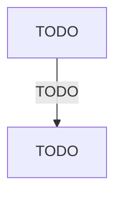

import { Aside, Badge, Card, CardGrid, Code, LinkCard, Steps, TabItem, Tabs } from '@astrojs/starlight/components';
import { Recall, Actions, Passage, Margin } from '@components';

{/* FIVE RULES THAT BREAK EVERY FIRST DRAFT. All five are in md-spec.md.

    1. MDX has no HTML comments. A comment is a brace, a slash, a star ... a
       star, a slash, a brace. AND A LITERAL STAR-SLASH INSIDE ONE CLOSES IT
       EARLY, which is how this exact line broke the sibling project's build.
    2. A bare less-than sign or an opening brace in prose is SYNTAX, not text.
       Put it in backticks.
    3. Blank lines around a component's inner content, or the Markdown inside
       it is not parsed as Markdown. Silent: it renders, just wrongly.
    4. The paste fence is FOUR backticks. This file contains three-backtick code
       blocks, and a three-backtick wrapper closes on the first one.
    5. Internal links are ROOT-ABSOLUTE. A relative ../ chain is a hard build
       error, never resolved. Paths are in src/generated/book-slugs.md.

    AND ONE STANDARD UNDER ALL OF IT, his instruction of 2026-09-14:
    "The user must be able to interpret and understand every sentence produced."
    Complete sentences, every term defined where it first appears, an example
    beside every difficult idea, and no length limit on explanation.
    context/standards.md section 2b. */}

{/* OUTLINE:START — generated by scripts/new-chapters.mjs from book.json. Do not edit by hand. */}
{/* THE BRIEF DECIDED THIS. Generation fills prose into it, and never invents it.

   book        Deep Work — Cal Newport
   chapter     5 · Rule #2: Embrace Boredom
   part        The rules — Run a concrete system — a scheduling philosophy, a boredom-tolerance practice, a tool-selection rule and a shallow-work budget — that turns the belief into actual deep work sessions.
   argues      The capacity to concentrate is trainable and also erodible: habitually reaching for stimulation the moment a task gets effortful teaches your brain to expect novelty, which undermines your ability to concentrate even when you intend to.
   weight      load-bearing in the book's argument
   verdict     deep-dive
   estimate    30 min
   clarified   false

   clarified false, so the clarified-chapter section has been REMOVED from this
   file entirely. READ I is the original text. On familiar material a summary
   preserves the idea and deletes the machinery that made it actionable.

   gap         execution — reading will not fix a doing problem. Weight the actions, trim the explanation.

   The reader writes the recall section CLOSED BOOK, before reading the
   explanation layer, and fills the open-questions section by hand.
   Never write in either. */}
{/* OUTLINE:END */}

## Pre-context

{/* PRODUCED ON EVERY CHAPTER, clarified or not. P3 part A. Orientation is not
    summary: you need it before the ORIGINAL text as much as before a rebuild.
    This used to be listed as P3-only, which left it with no producer at all on
    a clarified: false chapter — chapter-spine.md section 1, "the three
    orphans".

    AS LONG AS IT NEEDS TO BE. Every term the chapter uses without defining is
    defined here in plain words, with an example. It still never tells you what
    the chapter concludes. */}

TODO — what you need to have in mind before opening this chapter. Not a summary of it.

## Core message

{/* clarified: true  -> P3 produces this, before you read.
    clarified: false -> P4 produces it, AFTER your closed-book recall is marked.
    On familiar material, receiving the extraction before you read IS the
    summary that deletes the machinery. */}

:::note[Core message]
TODO — one sentence, in plain words. If it takes two, the chapter has two messages and the brief should say so.
:::

## Key points

{/* Same producer rule as Core message above.

    NO LENGTH LIMIT, his instruction of 2026-09-14. Each point is one plain
    sentence in bold — the claim — followed by as much explanation as that claim
    needs: what it means, why the author holds it, and an example. Ordered by
    how much of the argument rests on it, not by where it appears, so the points
    come out unevenly sized. A list of bare claims is a précis. */}

TODO — the load-bearing claims, each explained, not a précis.

## Recall

<Recall minutes={10}>

TODO — **you** write this. Book shut, page collapsed, assistant off, BEFORE reading the
explanation layer below.

Then: the questions you could not answer.

</Recall>

## The explanation layer

{/* TEN sub-sections, generated below from chapter-spine.md section 3. The first
    is `### Where the author was standing`, added on his own instruction: a
    thought is derived from the circumstances of whoever had it, and knowing
    those is part of understanding what the claim actually means.

    Since 2026-09-14 the full biography lives ONCE, on the book page, as
    Author context. The first sub-section here says only what about the author
    bears on THIS chapter's claim. And What real readers say follows the method
    in chapter-spine.md section 3b: venues, counts, clusters, the AI summary or
    the threads to read.

    It is here rather than in Pre-context because the explanation layer is read
    AFTER the closed-book recall — author context placed before the chapter
    would frame the reading and bias the retrieval.

    To push a spine change into stubs that already exist:
      node scripts/new-chapters.mjs <d> <c> <b> --spine
    It refuses any chapter that has been written in, and names it. */}

{/* SPINE:START — generated by scripts/new-chapters.mjs from book.json. Do not edit by hand. */}

### Where the author was standing

{/* What about the author and their moment bears on THIS chapter's claim, and what that predicts about where its argument bends. The full biography is on the book page, under Author context — link to it rather than repeating it. It never explains the argument away. */}

TODO

### What the author is actually saying

{/* The argument, stated more plainly than the chapter states it, with an example of the claim in action. */}

TODO

### Where readers get confused

{/* The specific misreadings, each with the correct reading beside it — not "some find it difficult". */}

TODO

### The teaching pass

{/* The mechanism, taught rather than summarised: at least one worked case, and an analogy where the idea is abstract. */}

TODO

### What real readers say

{/* Clusters of opinion from a wide sample, chapter-spine.md section 3b: where you looked and N read; each cluster as n of N with linked quotes; who is speaking; the Reddit Answers summary quoted, or the query and the threads to read; what it adds up to. Under 30 opinions, write THIN with the number. */}

TODO

### What critics say

{/* The strongest case against, argued properly. */}

TODO

### What's been tested since

{/* Replication, later evidence, what has failed to hold — and what has supported it. Every chart value sourced, or the chart titled illustrative. */}

TODO

### How practitioners actually use it

{/* What people who operate this do, at a stated scale, with real and sourced cases. */}

TODO

### Where it doesn't transfer

{/* Where the CLAIM'S CONDITIONS differ — economics, institutions, country, stage of life. Describe the difference; never conclude that it therefore does not apply to him. That conclusion is his, and it belongs with the recall. ADD, never subtract. */}

TODO

### The version to hold

{/* The synthesis. What survives all nine sections above. */}

TODO

{/* SPINE:END */}

## Dialogue

{/* THE ORDER IS THE POINT. Question first, position second, and the page must
    show them that way round — sycophancy is triggered by conveying a belief,
    so a position stated before the answer makes that answer suspect.

    AND THE WHOLE EXCHANGE, his instruction of 2026-09-14. Every turn after the
    first position goes under How the exchange went, in order, each starting
    with a bold label on its own paragraph: Me, colon — or AI, colon — or
    AI (as sceptic), colon. A paragraph with no label belongs to the turn above
    it. His turns are his words. chapter-spine.md section 6. */}

### What I asked

TODO

### What it said

TODO

### What I then argued

TODO

### How the exchange went

TODO

### Where we ended up

TODO

## Concept map

{/* A CAPTION SENTENCE FIRST: what the map shows and how to read it.

    It must read cleanly INSIDE the text column — every diagram also gets an
    Expand control, but Expand is for detail, not rescue. Grow down, not across
    (flowchart TD or mindmap), no more than about four nodes side by side,
    about twelve nodes before splitting into two maps, short labels, every edge
    labelled, at least one cross-link. chapter-spine.md section 6b. */}

TODO — one or two sentences: what this map shows, and how to read it.

## Actions

{/* <Actions /> AND NOTHING ELSE. The actions are frontmatter data.

    TWO TO TEN per chapter, his instruction of 2026-09-14, each anchored to a
    named claim in this chapter. At most ONE across the whole book carries
    committed: true with tier: now, and he writes it. chapter-spine.md 6c. */}

<Actions />

## The 30-second version

TODO — what you would say about this chapter in a lift, in complete sentences with no undefined term.

## Open questions

{/* LEFT EMPTY DELIBERATELY. The AI never writes here. Questions you could not
    answer are the highest-value note anyone keeps and the ones nobody records;
    this section exists to make you record them. */}

## Sources

| Claim | Source | Read on | Tier |
| --- | --- | --- | --- |
| TODO | TODO | TODO | TODO |
