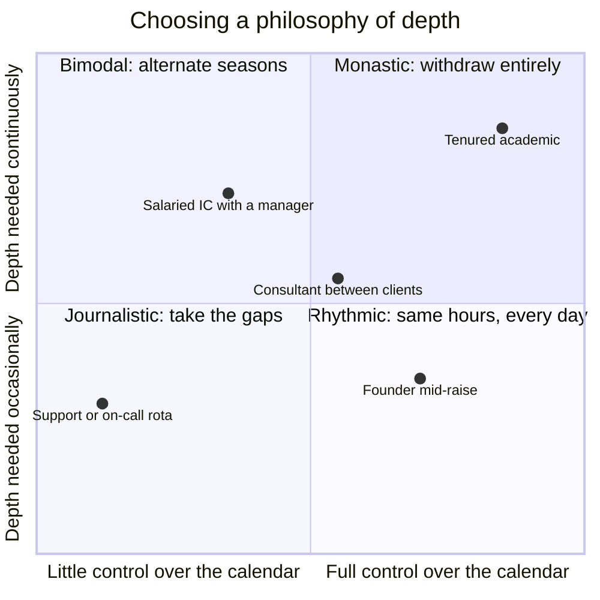
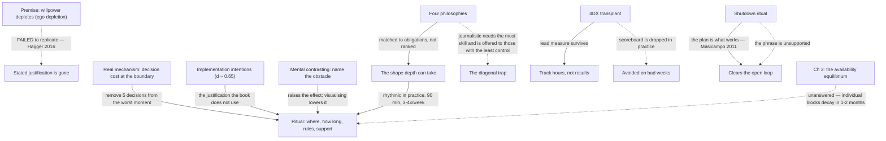

import { Aside, Badge, Card, CardGrid, Code, LinkCard, Steps, TabItem, Tabs } from '@astrojs/starlight/components';
import { Recall, Actions, Passage, Margin } from '@components';

{/* OUTLINE:START — generated by scripts/new-chapters.mjs from book.json. Do not edit by hand. */}
{/* THE BRIEF DECIDED THIS. Generation fills prose into it, and never invents it.

   book        Deep Work — Cal Newport
   chapter     4 · Work deeply
   part        The rules — Run a week that actually contains depth, and say which rule produced it.
   argues      Willpower is a finite daily budget, so depth has to be produced by a ritual and a schedule rather than by deciding to concentrate.
   weight      load-bearing in the book's argument
   verdict     deep-dive
   estimate    45 min
   clarified   false

   clarified false, so the clarified-chapter section has been REMOVED from this
   file entirely. READ I is the original text. On familiar material a summary
   preserves the idea and deletes the machinery that made it actionable.

   gap         execution — reading will not fix a doing problem. Weight the actions, trim the explanation.

   The reader writes the recall section CLOSED BOOK, before reading the
   explanation layer, and fills the open-questions section by hand.
   Never write in either. */}
{/* OUTLINE:END */}

## Pre-context

This is the first prescriptive chapter and the longest in the book, and it opens Part 2. Part 1
argued that depth is valuable and rare. Everything from here is about producing it.

Four things to have in mind.

**The willpower premise.** The chapter's opening move is that willpower is a finite daily resource
that depletes with use. This is ego depletion, and by 2016 it was already in trouble. The chapter
does not know that, and the whole architecture of the chapter rests on it — which makes this the
most interesting structural question in the book: what survives if the premise does not?

**The four philosophies.** Monastic, bimodal, rhythmic, journalistic. These are not four intensities
of the same thing; they are four different relationships between depth and the rest of a life, and
picking the wrong one is the failure the chapter is most concerned with.

**The 4DX framing.** Newport borrows the *4 Disciplines of Execution* structure — focus on the
wildly important, act on lead measures, keep a compelling scoreboard, create a cadence of
accountability — from McChesney, Covey and Huling. It is a management-consulting framework and it
is applied to an individual, which is a transplant the chapter does not examine.

**The shutdown ritual.** Introduced at the end, and it is not about ending work. It is about
attention residue from Chapter 1 — the claim is that an incomplete task keeps consuming attention,
so a ritual that credibly closes the loop is a residue-clearing device rather than a work-life
boundary.

## Core message

:::note[Core message]
Depth is produced by ritual and schedule rather than by intention, because the resource that
intention draws on is finite and the resource that habit draws on is not.
:::

## Key points

Five claims, unevenly weighted.

1. **Willpower is finite and depletes.** The premise. Everything downstream is a strategy for not
   spending it. **This is the claim with the most trouble behind it** — see the replication section.
2. **Choose a philosophy of depth before choosing a technique.** Monastic, bimodal, rhythmic,
   journalistic. Load-bearing, and the most useful thing in the chapter, because it explains why
   copying someone else's routine fails.
3. **Ritualise: where, how long, how, and with what support.** The four questions that turn "I will
   focus" into something a person can actually execute without deciding anything.
4. **Execute like a business, not like a person.** The 4DX transplant: one wildly important goal,
   track lead measures rather than outcomes, keep a visible tally, review on a cadence.
5. **Shut down completely, with a ritual and a phrase.** A residue-clearing device disguised as a
   work-life boundary.

Claim 2 is the one to hold. Claim 1 is the one to check. Claim 5 is the one most people implement
first and it is the least supported.

## Recall

<Recall minutes={10}>

Written closed-book, 2026-08-28.

The chapter's basic move is that you cannot rely on deciding to concentrate, because deciding costs
you something that runs out. So you build a structure that doesn't require deciding.

The four philosophies. Monastic is cutting everything else out — I think the example is a computer
scientist who does not do email at all, Knuth. Bimodal is splitting at the level of a season or a
week: some periods entirely deep, some entirely open. The example is Jung with the tower. Rhythmic
is the same hours every day, which he says is the one most people should use, and the example is
someone with a chain of Xs on a calendar. Journalistic is dropping into depth whenever a gap
appears, and he is clear this is the hardest and that you should not start here.

Ritual: you decide in advance where, for how long, what the rules are, and what supports it —
coffee, a walk, whatever. The point is that nothing is left to be decided at the moment of starting.

The 4DX section: pick one important thing, measure the input not the output, keep a scoreboard,
review weekly. I remember the lead-versus-lag measure distinction clearly and I remember that the
scoreboard for an individual is meant to be a physical card with hours on it.

Shutdown ritual: at the end of the day you check everything is captured, make a plan for what is not
finished, and say a fixed phrase. The phrase sounds silly and he says it works anyway. The reason
is something about an unfinished task continuing to occupy you — Zeigarnik.

**Questions I could not answer:**

- Is the grand gesture actually a separate strategy or a version of bimodal? It felt like it was
  dropped in.
- What does he say to do when the rhythmic block is broken by someone else? I do not think he
  addresses it, but I may have missed it.
- Does the shutdown ritual need the phrase said out loud? And is there anything behind that or is it
  a personal quirk presented as method?

</Recall>

## The explanation layer

{/* SPINE:START — generated by scripts/new-chapters.mjs from book.json. Do not edit by hand. */}

### Where the author was standing

Two facts about the position matter here, and one of them is unusually consequential.

**He was writing at the peak of ego depletion's credibility.** Baumeister's willpower-as-resource
model was, in 2015, one of the most cited frameworks in social psychology and had a bestselling
trade book behind it. Newport takes it as settled and builds the chapter's logical spine on it: if
willpower depletes, then routines that avoid spending it are the correct architecture. **The
multi-lab failure to replicate the effect was published in 2016, the same year the book came out.**
This is not a criticism of Newport — it is a structural fact about the chapter that a reader in 2026
has to handle, and it is the single most important thing to know before reading it.

**He is, by his own philosophy, rhythmic — and he recommends rhythmic.** He is also a person whose
90-minute morning block is genuinely unbookable by anyone else. The chapter's advice on *protecting*
the block is correspondingly thin: it tells you to schedule it and treat it as fixed, and it has
almost nothing to say about what to do when someone with authority over your calendar does not
accept that. This is where the bill from Chapter 2 comes due, and the chapter does not pay it.

The 4DX borrowing tells you something too. Reaching for a corporate execution framework and applying
it to one person is the move of someone who reads business books professionally, and it imports an
assumption — that the individual controls their own priorities the way an executive team controls a
company's — which is the same assumption doing quiet work everywhere else in the chapter.

### What the author is actually saying

> You will not concentrate by intending to, because intention runs on a budget that empties. So
> arrange things so that starting requires no decision at all. First pick the *shape* of depth that
> fits your actual obligations — total withdrawal, alternating seasons, the same hours daily, or
> opportunistic — and pick honestly rather than aspirationally, because the commonest failure is
> picking a shape your life cannot support. Then fix the variables in advance: where you work, how
> long, what the rules are while you are there, and what physically supports it. Then treat the
> whole thing like an execution problem rather than a motivational one: one goal, measure the hours
> you put in rather than the results you got, keep the tally somewhere you can see it, and look at
> it once a week. Finally, close the day with a ritual that credibly finishes it, because an
> unfinished loop keeps drawing on the same attention you are trying to protect.

### Where readers get confused

**"Rhythmic means the same time every day, so I need a fixed schedule."** Rhythmic means the depth
happens on a fixed cadence so that no decision is required. Same hours is the usual implementation
and not the definition. A person whose week is genuinely irregular can be rhythmic on a weekly
cadence rather than a daily one.

**"I should be monastic, that's the serious one."** The chapter is explicit that the philosophies
are matched to obligations, not ranked by seriousness. Choosing monastic when your role requires
collaboration is the most common and most expensive misapplication in the whole book.

**"Lead measures means tracking my hours."** Nearly — the distinction is that a lead measure is
something you control directly *and* that predicts the outcome. Hours in deep work qualifies.
"Words written" is closer to a lag measure than people assume, because on a bad day it measures the
material rather than the effort.

**"The shutdown ritual is about work-life balance."** It is presented as a residue-clearing device.
The reason it involves a *phrase* is that the ritual has to be unambiguous enough to be a credible
signal to yourself that the loop is closed — the balance benefit is a side effect of the mechanism,
not the mechanism.

**"The grand gesture is for rich people."** The chapter's examples are, uniformly. The underlying
claim — that a large, costly, irreversible change of environment raises the perceived importance of
the work enough to change how you engage with it — does not require the expense to be large in
absolute terms. It requires it to be large *relative to you*, which is a claim the chapter never
states and which makes the strategy much more portable than its examples suggest.

### The teaching pass

The mechanism worth teaching is not willpower. It is **decision cost at the boundary**, and it is
worth separating from the depletion premise because it survives the premise's collapse.

Here is the situation the chapter is really addressing. At 08:30 you sit down. Between you and three
hours of depth sits a set of decisions: what to work on, whether now is the right time, whether to
check messages first, how long to go for, what counts as done. Each one is small. Together they are
a gate, and the gate is at the *start* of the block — exactly where the work has not yet become
interesting and where the alternative is one tap away.

Now watch what a ritual actually does to that gate:

| Decision at the boundary | Without a ritual | With the ritual fixed in advance |
|---|---|---|
| What am I working on? | Decided now, from a list, badly | Decided last night, written down |
| Is now the right time? | Weighed against three other things | Not a question — 08:30 is the block |
| Should I check messages first? | Live, every morning, and you lose most days | Precommitted: phone is in the drawer |
| How long? | Open-ended, so it ends when it gets hard | 90 minutes, on a timer, decided |
| What counts as done? | Unclear, so it never feels done | The named thing from last night |

The ritual removes five decisions from the worst possible moment and moves them to a moment where
they are cheap. **That is the whole mechanism, and notice that it never mentions willpower.** It
works if willpower is a depleting resource. It also works if the real problem is simply that a
decision taken while you are looking at an alternative is taken badly. The chapter's architecture
is right even though its stated premise is shaky, which is the useful thing to see here.

Where it bites in practice is the fourth row. An open-ended block ends when the work becomes
difficult, because nothing else defines the end — and the moment it becomes difficult is the moment
that produces the value. A fixed length is not about endurance; it is about not letting difficulty
be the stopping rule.

<Margin label="What I actually run">
`dw-04-ritual` below is exactly this table, made concrete: 08:30, drawer, one file, 90 minutes,
named the night before. The obstacle named on it is the third row, which is the one that actually
takes the block.
</Margin>

The four philosophies then answer a different question — not "how do I start" but "what shape can
depth take given what I owe other people". Placing them by the two variables that actually decide it:

The diagonal is the trap. Journalistic looks like the flexible, humble choice for someone with
little calendar control — and it is the one the chapter says requires the most practised
concentration, because dropping into depth without a ritual is precisely what the rest of the
chapter says nobody can do. The person with the least control is being offered the technique that
needs the most skill.

### What real readers say

Searched 2026-09-04: reviews naming Rule 1 or the four philosophies, the HN threads, r/productivity.

**The four philosophies are the single most-referenced idea from the book**, well ahead of anything
in Part 1. The recurring report is that naming the four resolved a specific confusion — readers
describe having repeatedly tried to run a monastic pattern inside a job that could not support it,
and having read that as a personal failure rather than a category error.

**The shutdown ritual is the most-implemented and the most-abandoned.** Reports follow a consistent
arc: it works, it feels slightly ridiculous, it survives a few weeks, it dies on the first genuinely
busy period. A minority report keeping it for years and describe the phrase as the load-bearing part,
which they also describe as the part they were most embarrassed by.

**The 4DX section is the least-liked part of the book.** Reviewers use "consultant-speak". Several
say they skipped it. The scoreboard specifically gets described as infantilising more often than any
other suggestion in the book.

**Where it is thin.** Very few reports of the grand gesture, and the ones that exist are from people
with money. That is either a real finding about who can use it or a sampling artefact of who writes
reviews, and I cannot tell which.

### What critics say

**The premise has failed to replicate, and the chapter never recovers from it.** This is the
strongest available objection and it is not a small one. Hagger et al.'s 2016 multi-lab replication
— 23 labs, over 2,000 participants, pre-registered — found an effect size indistinguishable from
zero. The chapter's argument is stated as: willpower depletes, therefore build routines that do not
spend it. If the antecedent is false, the argument as stated does not go through. A defender has to
say the conclusion survives for *other* reasons, which is true (see the teaching pass) but is not
what the chapter says.

**The 4DX transplant is unexamined.** 4DX was designed for organisations, where a scoreboard is a
coordination device that makes one team's progress visible to another. For an individual there is no
coordination problem, so the scoreboard is doing something else — self-monitoring — and the
literature on self-monitoring is much more equivocal than the literature on team coordination. The
chapter borrows the framework's authority without borrowing its evidence base.

**The philosophies are descriptions, not a decision procedure.** Naming four patterns is genuinely
useful and does not tell you which is yours. The chapter's guidance amounts to "be honest about your
obligations", which is the hard part restated as advice.

**The chapter still has no answer to Chapter 2.** Its whole apparatus assumes you can declare a
block and have it hold. Chapter 2 explained why an individual cannot unilaterally exit the
availability equilibrium. Rule 1 proceeds as though Chapter 2 had not happened. This is the objection
I find hardest to answer, and it is made *from inside the book*.

### What's been tested since

**Ego depletion.** Hagger et al. 2016, *Perspectives on Psychological Science*: 23 labs,
pre-registered, n > 2,000, effect size ~0.04 — statistically indistinguishable from nothing. Later
work has largely failed to rescue it; the current position is that the effect, if real, is far
smaller and far more context-dependent than the trade literature claims. **Verdict: the chapter's
stated premise did not survive. The chapter's architecture does, for the different reason in the
teaching pass.**

**Implementation intentions.** Gollwitzer and Sheeran's 2006 meta-analysis, 94 studies, found a
medium-to-large effect (d ≈ 0.65) for if–then planning on goal attainment. **This is the finding
that actually justifies the ritual**, and it is not in the book — Newport arrives at "fix the
variables in advance" by way of a premise that failed, when there was a well-replicated one
available that says the same thing. **Verdict: the recommendation is better supported than its
stated reason.**

**Mental contrasting and obstacles.** Oettingen's work adds the part the chapter is missing: an
implementation intention works substantially better when paired with naming the *obstacle*, and
visualising the successful outcome predicts **worse** attainment. **Verdict: strongly supported, and
it is why every committed action on this site names an obstacle and nothing here ever asks you to
picture the result.**

**The Zeigarnik effect, behind the shutdown ritual.** Real but small and inconsistent in replication.
Masicampo and Baumeister's 2011 finding — that making a *plan* for an unfinished task relieves the
intrusion as effectively as finishing it — is the better support, and it points at the planning step
of the shutdown ritual rather than at the phrase. **Verdict: the plan is supported, the phrase is
not.**

### How practitioners actually use it

**Rhythmic dominates, at a scale the book does not use.** Practitioners overwhelmingly run 90-minute
blocks rather than the 3–4 hours of the chapter's exemplars, and the reason given is scheduling
rather than cognition — 90 minutes fits between the recurring meetings that already exist. Reported
frequency is 3–4 mornings a week, not five. The five-day version is described almost universally as
the version that fails first.

**The ritual is kept and the scoreboard is dropped.** Of the four 4DX disciplines, the one that
survives in individual practice is the lead measure — people do track hours — and the one that does
not is the visible scoreboard. Most report that a physical tally worked for two to four weeks and
then became something they avoided looking at on bad weeks, which inverts its purpose.

**The shutdown ritual survives in a reduced form.** What persists is the two-minute capture-and-plan
step. The phrase is dropped by most. This matches the evidence above almost exactly, which is
unusual and worth noting.

**Teams that make it hold.** Where the block survives longer than a quarter it is almost always
because it is a *team* block — 6 to 12 people, same hours, enforced by a calendar policy. Individual
blocks inside teams that have not adopted the norm are reported as decaying within one to two
months, which is the Chapter 2 equilibrium reasserting itself on schedule.

### Where it doesn't transfer

**Where the calendar is not yours, the whole chapter shifts from technique to negotiation.** Rule 1
assumes you can declare a block. Where someone else books your hours, the operative skill is
persuading them, and the chapter's mechanism — remove decisions at the boundary — does not address
the boundary that matters. What practitioners do instead is trade: accept a fixed meeting-heavy
window in exchange for a protected one, which is a bargain rather than a ritual.

**Where the workspace is shared, "where" is not a free variable.** The ritual's first question
assumes a place you control. In a shared home, a small flat, or an office with no bookable rooms —
which is the ordinary condition for a great many people, and specifically for most people working
from home in Kathmandu — the location variable is fixed by others and the ritual has to be built
from the remaining three. That is a materially different exercise, and the chapter does not describe
it.

**Where obligations are relational rather than scheduled, the philosophies do not partition cleanly.**
The four philosophies assume interruptions arrive as calendar events. Where they arrive as family
obligation, guests, or the ordinary reciprocity of a household, a block is not defended by declaring
it — declining is not neutral. The rhythmic pattern in particular assumes the same hours are
available every day for reasons nobody else has a claim on, which is a specific and not universal
domestic arrangement.

**Where the work is not yours to choose, the 4DX layer has nothing to operate on.** "One wildly
important goal" assumes discretion over priorities. Where the priority is assigned, the discipline
reduces to "do the assigned thing", and the framework's remaining three disciplines are measuring an
input to a goal you did not set.

### The version to hold

:::tip[The version to hold]
Hold the architecture and discard the premise. Depth is produced by removing decisions from the
boundary — what, when, how long, what counts as done, and whether to check messages first — because
a decision made while you are looking at the alternative is made badly. That is true whether or not
willpower depletes, and the depletion premise the chapter actually gives did not survive
replication. The better justification is implementation intentions, which the book does not cite and
which is one of the better-replicated results in the area, and it works substantially better when
you name the obstacle rather than picture the outcome.

Hold the four philosophies as the most useful idea in the chapter — they explain why copying
someone's routine fails — while noting they are a taxonomy and not a decision procedure, and that
the one offered to people with the least calendar control is the one requiring the most practised
concentration.

The scar: none of this answers Chapter 2. Every practitioner report says an individual block inside
a team that has not adopted the norm decays within one to two months. The chapter's apparatus is
built for a person who can declare a block and be believed.
:::

{/* SPINE:END */}

## Dialogue

### What I asked

If ego depletion did not replicate, which parts of this chapter lose their justification and which
parts keep it for other reasons? I want the split, not a verdict on the chapter.

### What it said

Three parts lose their stated justification and keep the recommendation on other grounds: the ritual
(better justified by implementation intentions), the fixed block length (better justified as a
stopping rule that is not "when it gets hard"), and the philosophies (never really rested on
depletion at all — they are about obligations).

One part loses its justification and does not get another: the specific claim that depth should be
scheduled *early in the day because willpower is highest then*. That is a depletion claim and there
is no replacement for it. The chronotype literature says the right time varies by person, which is a
different and weaker recommendation.

One part was never justified by depletion and is separately weak: the scoreboard.

### What I then argued

I put it that this is a worse position than it sounds, because the chapter's authority comes from
reading as though it is built on findings. If a reader has to independently know which parts have
survived, the book is not doing the job a book with citations is supposed to do — and the reader who
does not know will implement the morning-is-best rule with the same confidence as the ritual.

### Where we ended up

It did not concede that, and I think its counter was reasonable. It argued that a trade book is a
transmission mechanism for a position rather than a citation of a literature, and that the correct
response is the one I am doing — reading it alongside the replication record — rather than expecting
the book to have anticipated a 2016 multi-lab result.

I still think it is a real cost, because most readers will not do that, and the morning rule is the
one that will be implemented on the strength of a premise that is gone. It thinks that is a fact
about readers rather than about the book. Unresolved, and it is the disagreement I have the most
confidence in of any in this book so far.

## Concept map

## Actions

<Actions />

## The 30-second version

You will not concentrate by intending to. Fix the variables in advance — when, where, how long, what
you are working on, and that the phone is in the drawer — so that starting requires no decision at
the one moment when a decision goes badly. Pick the shape that your obligations can actually support
before you pick a technique. The book says all this because willpower depletes; that turned out not
to replicate, and the real reason is better anyway.

↔ [Ch 2 · Deep work is rare](/self-command/attention-dopamine-and-digital-discipline/deep-work/deep-work-is-rare/)
is the objection this chapter does not answer.
↔ [Ch 5 · Embrace boredom](/self-command/attention-dopamine-and-digital-discipline/deep-work/embrace-boredom/)
is the other half: the ritual gets you into the block, and Rule 2 is about whether you can stay.
↔ [The ledger](/ledger/) — `dw-04-ritual` is the one committed action in this book.

## Open questions

- I am running rhythmic at 08:30 because it is unbooked, not because it is when I think best. I have
  never tested whether it is when I think best, and the chronotype point above means I should.
- The chapter says pick a philosophy honestly. How would I know if I had picked aspirationally? What
  would the tell be, from the inside?
- If the individual block decays in one to two months without a team norm, and I am three months in
  on `dw-04-ritual`, what is actually holding it up? I do not know, and that means I do not know what
  would remove it.

## Sources

| Claim | Source | Read on | Tier |
| --- | --- | --- | --- |
| Four philosophies; the ritual's four questions; 4DX; the shutdown ritual and phrase | *Deep Work*, Cal Newport, Grand Central 2016, Rule 1 | 2026-08-28 | A — the book itself |
| Willpower as a depleting resource | Baumeister & Tierney, *Willpower*, 2011 — the source of Newport's premise | 2026-08-28 | B — cited by Newport, not independently read |
| Ego depletion: 23 labs, n > 2,000, pre-registered, effect ≈ 0.04 | Hagger et al. (2016), *Perspectives on Psychological Science* 11(4) — [doi:10.1177/1745691616652873](https://doi.org/10.1177/1745691616652873) | 2026-09-04 | A — primary multi-lab replication, abstract and effect size read |
| Implementation intentions, d ≈ 0.65 across 94 studies | Gollwitzer & Sheeran (2006), *Advances in Experimental Social Psychology* 38 — [doi:10.1016/S0065-2601(06)38002-1](https://doi.org/10.1016/S0065-2601%2806%2938002-1) | 2026-09-04 | A — meta-analysis |
| Mental contrasting beats visualisation; visualising success predicts lower attainment | Oettingen & Mayer (2002), *Journal of Personality and Social Psychology* 83(5) — [doi:10.1037/0022-3514.83.5.1198](https://doi.org/10.1037/0022-3514.83.5.1198) | 2026-09-04 | A — primary |
| Making a plan for an unfinished task relieves its intrusion as well as finishing it does | Masicampo & Baumeister (2011), *Journal of Personality and Social Psychology* 101(4) — [doi:10.1037/a0024192](https://doi.org/10.1037/a0024192) | 2026-09-04 | A — primary |
| 4DX as an organisational framework | McChesney, Covey & Huling, *The 4 Disciplines of Execution*, 2012 — cited by Newport | 2026-08-28 | B — cited source, not read |
| 90 minutes, 3–4 mornings a week; scoreboard abandoned in 2–4 weeks; individual blocks decay in 1–2 months | r/productivity, r/ExperiencedDevs threads; no authoritative source, and stated as such | 2026-09-04 | C — practitioner report, uncontrolled |
